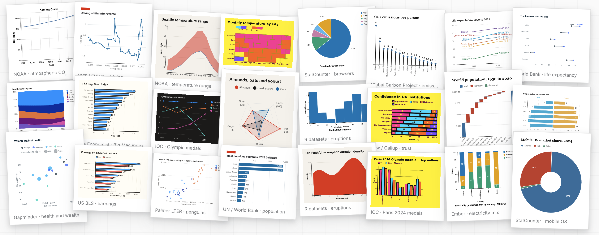

# Flint：AI 時代のための可視化言語

[English](README.md) | [简体中文](README.zh-CN.md) | **日本語**

[](https://www.npmjs.com/package/flint-chart)
[](https://www.npmjs.com/package/flint-chart-mcp)
[](https://github.com/microsoft/flint-chart/actions/workflows/ci.yml)
[](LICENSE)

**こちらをご覧ください：** [**Flint プロジェクトサイト**](https://microsoft.github.io/flint-chart/) | [**MCP サーバーガイド**](https://microsoft.github.io/flint-chart/#/mcp) | [**中国語ホームページ**](https://microsoft.github.io/flint-chart/#/zh)

Flint は、**AI エージェントがシンプルで人間にも編集しやすいチャート仕様から、
表現力豊かで洗練された可視化を作成できる**ようにする可視化中間言語です。
エージェントや開発者がスケール、軸、間隔、ラベル、レイアウトなどの
冗長なチャート設定を細かく調整する代わりに、Flint コンパイラーが
データ、セマンティック型、チャートタイプ、エンコーディングから最適な
チャート設定を導出します。その結果、エージェントが安定して生成でき、
人間が直接編集でき、複数のバックエンドがネイティブな
[Vega-Lite](https://vega.github.io/vega-lite/)、
[ECharts](https://echarts.apache.org/)、または
[Chart.js](https://www.chartjs.org/) の仕様としてレンダリングできる、簡潔なチャート仕様が得られます。

このリポジトリには、主に 2 つのコンポーネントがあります：

- **`flint-chart`**：同じ Flint 入力を Vega-Lite、ECharts、または
  Chart.js の仕様にコンパイルする JavaScript/TypeScript ライブラリです。
- **`flint-chart-mcp`**：エージェントがチャットやコーディング環境から
  直接チャートを作成、検証、レンダリングできる MCP サーバーです。

<p align="center">
  
</p>

## 機能


- **セマンティックなチャート仕様。** Flint は `Rank`、`Temperature`、
  `Price`、`Country` など、70 種類以上のセマンティック型を使用して各フィールドの意味を表します。
- **自動レイアウト。** Flint はデータのカーディナリティ、チャート設計、
  キャンバスの制約に応じて、サイズ、間隔、ラベル、マーク、凡例を調整します。
- **複数のバックエンド。** 1 つの入力から
  [Vega-Lite](https://vega.github.io/vega-lite/)、
  [ECharts](https://echarts.apache.org/)、
  [Chart.js](https://www.chartjs.org/) を通じて 30 種類以上のチャートタイプにコンパイルでき、今後さらに追加される予定です。
- **エージェント向けのチャート作成。** MCP サーバーはエージェントに Flint のツールと
  チャート作成ガイドを提供し、テンプレートの選択、検証、MCP 対応クライアントでの
  インタラクティブなチャートビューの表示を可能にします。

## 更新情報

- **2026 年 7 月 19 日** — Flint 0.3.0 では、チャートタイプの切り替えと
  チャートプロパティの直接編集ができる動的チャートウィジェットが追加されました。([v0.3.0](https://github.com/microsoft/flint-chart/releases/tag/0.3.0))
- **2026 年 7 月 15 日** — Flint 0.2.2 では、コンパクトなドッジモードと
  グループ化バイオリンプロットのレイアウトが追加されました。
- **2026 年 7 月 13 日** — Flint 0.2.1 では、チャートプロパティの検証と
  バックエンド間の一貫性が改善されました。([v0.2.1](https://github.com/microsoft/flint-chart/releases/tag/0.2.1))

すべてのリリースノートについては、[変更履歴](CHANGELOG.md)をご覧ください。


<p align="center">
  
  <br>
  <sub>Flint は簡潔なチャート仕様を、バックエンドネイティブの仕様とレンダリング済みの可視化に変換します。</sub>
</p>

## インストール

```bash
# Use Flint in your JavaScript/TypeScript codebase
npm install flint-chart

# For agents and MCP clients
npx -y flint-chart-mcp
```

<p><sub><span style="color: #6a737d;">Python パッケージは今後リリース予定です。現在の Python ポートは、このリポジトリでソースのみのプレビューとして提供されています。</span></sub></p>

## Flint をライブラリとして使用する

すべてのバックエンドが同じ `ChartAssemblyInput` を受け取り、対象
ライブラリのネイティブな仕様オブジェクトを返します。

```ts
import { assembleVegaLite } from 'flint-chart';

const spec = assembleVegaLite({
  data: { values: myData },
  semantic_types: { weight: 'Quantity', mpg: 'Quantity', origin: 'Country' },
  chart_spec: {
    chartType: 'Scatter Plot',
    encodings: { x: { field: 'weight' }, y: { field: 'mpg' }, color: { field: 'origin' } },
    baseSize: { width: 400, height: 300 },
  },
});
// → a ready-to-render Vega-Lite spec
```

入力形式を変えずにバックエンドを切り替えられます：

```ts
import { assembleECharts, assembleChartjs } from 'flint-chart';

const echartsOption = assembleECharts(input);
const chartjsConfig = assembleChartjs(input);
```

ライブラリのその他の例については、[API リファレンス](docs/api-reference.md)、
[バックエンドリファレンス](docs/reference-vegalite.md)、
[ライブエディター](https://microsoft.github.io/flint-chart/#/editor)をご覧ください。

## Flint を MCP サーバーとして使用する

質問を始めた同じ会話内でエージェントにチャートを作成させたい場合は、
`flint-chart-mcp` を [Model Context Protocol](https://modelcontextprotocol.io/)
サーバーとしてインストールします。インタラクティブなチャートビューを開いたり、
静的な PNG/SVG 出力やバックエンドネイティブのチャート仕様を生成したりできます。

セットアップについては、まず
[Flint MCP プロジェクトページ](https://microsoft.github.io/flint-chart/#/mcp)をご覧ください。
クライアント設定、使用例、より詳しいリファレンスへのリンクが掲載されています。

<p align="center">
  
</p>

MCP 呼び出しでは、`data.values` として行を直接埋め込むことも、
`data.url` からローカルの JSON、CSV、TSV ファイルを読み込むこともできます。
MCP を使わないエージェントワークフローでは、独立した
[エージェントスキル](agent-skills/flint-chart-author/SKILL.md)を使用してください。

## リポジトリ概要

```
flint-chart/
├── packages/
│   ├── flint-js/          npm package `flint-chart` (TypeScript)
│   │   └── src/
│   │       ├── core/      semantics, layout, decisions, shared types
│   │       ├── vegalite/  Vega-Lite backend
│   │       ├── echarts/   ECharts backend
│   │       ├── chartjs/   Chart.js backend
│   │       └── test-data/ fixtures + generators (drive tests and the gallery)
│   ├── flint-py/          Python port preview (package to be released)
│   └── flint-mcp/         npm package `flint-chart-mcp` (MCP render server)
├── site/                  Vite + React demo: landing, gallery, editor, docs
├── agent-skills/          fallback copy of the MCP-served agent skill
├── shared/test-data/      JSON fixtures shared across JS + Python
└── docs/                  architecture and design documents
```

### ドキュメント

[プロジェクトサイト](https://microsoft.github.io/flint-chart/)は、使用例、
ライブエディター、概念ドキュメントへの主要な入口です。ソースレベルの
リファレンスについては、[API リファレンス](docs/api-reference.md)、
[Flint MCP プロジェクトページ](https://microsoft.github.io/flint-chart/#/mcp)、
[開発ガイド](docs/DEVELOPMENT.md)からご覧ください。各リリースの主な変更は
[変更履歴](CHANGELOG.md)に記載されています。

---

## コントリビューション

コントリビューションを歓迎します！[.github/CONTRIBUTING.md](.github/CONTRIBUTING.md)
と[開発ガイド](docs/DEVELOPMENT.md)をご覧ください。

```bash
git clone https://github.com/microsoft/flint-chart
cd flint-chart
npm install            # root workspaces: packages/flint-js + flint-mcp + site

npm run typecheck      # typecheck packages/flint-js + packages/flint-mcp
npm run test           # Vitest (packages/flint-js + packages/flint-mcp)
npm run build          # build packages/flint-js + packages/flint-mcp
npm run site           # demo site (gallery + editor) at http://localhost:5274/
```

Node 18 以降が必要です。デモサイトでは `flint-chart` が
`packages/flint-js/src` にエイリアスされるため、ライブラリへの編集は
`dist/` を再ビルドしなくてもギャラリーとエディターにホットリロードされます。

特に、新しい
[チャートテンプレート](docs/adding-a-chart-template.md)や
[レンダリングバックエンド](docs/adding-a-backend.md)のコントリビューションを歓迎します。

このプロジェクトは
[Microsoft オープンソース行動規範](.github/CODE_OF_CONDUCT.md)を採用しています。
セキュリティ上の問題を報告するには [SECURITY.md](.github/SECURITY.md) をご覧ください。

## コントリビューター

Flint は [Microsoft Research](https://www.microsoft.com/en-us/research/) と
中国人民大学の [IDEAS Lab](https://ideas-lab.net/) が共同で開発しています。
ぜひご参加ください。詳しくは[コントリビューション](#コントリビューション)をご覧ください。

Flint について説明する研究論文は近日公開予定です。

## 商標

このプロジェクトには、プロジェクト、製品、サービスの商標またはロゴが含まれる場合があります。
Microsoft の商標またはロゴの許可された使用には、
[Microsoft の商標およびブランドガイドライン](https://www.microsoft.com/en-us/legal/intellectualproperty/trademarks/usage/general)を遵守する必要があります。
このプロジェクトの変更版で Microsoft の商標またはロゴを使用する場合、
混同を招いたり、Microsoft の後援を示唆したりしてはなりません。
第三者の商標またはロゴの使用には、それぞれの第三者のポリシーが適用されます。

## ライセンス

[MIT](LICENSE) © Microsoft Corporation
