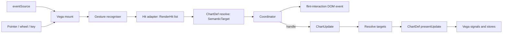

# Interaction spec: presets as a declarative API

Status: decisions confirmed 2026-09-11 (§7). Branch `feat/interactive-api`. Written 2026-09-10.

## 1. Problem

Today an interaction is only reachable from JavaScript:

```ts
import { buildInteractiveChart, clickHighlight, navigate } from 'flint-chart/interactive';

buildInteractiveChart(container, input, {
    backend: 'vegalite',
    interactions: [clickHighlight({ dimOpacity: 0.2 }), navigate({ axes: 'x' })],
});
```

The Flint spec (`ChartAssemblyInput`) says *what to draw* (`chart_spec`) and *how it
looks* (`theme_spec`). It has no field that says *how the chart behaves*. An agent that
authors a spec through the MCP server, the site editor, or a JSON file cannot ask for a
brush, a pan, or a legend toggle. The 20 presets in `interactive/presets/` are already
"behaviour as data" in everything but their entry point.

This document maps how interactions work now, then proposes a serializable
`interaction_spec` field, a registry that turns it into `InteractionDef[]`, spec-time
validation, and the host changes that make it useful.

## 2. How interactions work today

### 2.1 The layers

| Layer | Files | Owns |
| --- | --- | --- |
| Update language | `core/interaction-contracts.ts` | `ChartUpdate { id, ops }` and the seven ops: `set-style`, `set-annotation`, `set-viewport`, `set-order`, `set-overlay`, `set-freeform-overlay`, `set-data`. Pure JSON. |
| Semantic contracts | `core/interaction-contracts.ts`, `core/interaction-semantics.ts` | `SemanticElement`, `SemanticTarget`, `InteractionContext`, the ChartDef resolver and presenter signatures. |
| Triggers | `interactive/triggers.ts` | `InteractionEventSource` descriptors: `clickTrigger`, `hoverTrigger`, `axisBrushTrigger`, `angularBrushTrigger`, `navigationTrigger`, `inspectTrigger`, ... They say what input to capture. |
| Presets | `interactive/presets/*.ts`, wrapped by `interactive/interactions.ts` | Factories such as `clickHighlight(options)`. Each returns a `CanvasInteractionDef`: a trigger plus a `handle(event, context)` that maps a `CanvasInteractionEvent` to a `ChartUpdate`. |
| Surface | `interactive/index.ts`, `interactive/surface.ts` | `buildInteractiveChart()`; mounts a backend adapter, hosts external `dispatch()`, `applyUpdate()`, viewport rails. |
| Vega-Lite runtime | `vegalite/interactive.ts`, `vegalite/interactions/compile.ts`, `runtime.ts`, `hit-adapter.ts`, `presentation/*` | Instruments the compiled spec, recognises gestures, resolves hits, applies updates to Vega signals and stores. |
| Chart capabilities | `ChartTemplateDef.navigation`, `.reorder`, `.semanticInteractions()` in `core/types.ts` and each `vegalite/templates/*.ts` | What each chart type can do: navigable axes, reorderable axes, angular regions, selectable marks, semantic fields. |

Only the Vega-Lite backend implements the runtime. `buildInteractiveChart` throws at
mount for other backends when `interactions` is non-empty.

### 2.2 One interaction definition

```ts
interface CanvasInteractionDef {
    id: string;
    eventSource: InteractionEventSource;      // what to capture, e.g. { type: 'region', gesture: 'drag', axis: 'x' }
    affordances?: InteractionAffordance[];   // cursor and hover hints
    retainedStateGroup?: string;             // same-group retained updates replace each other
    claimsLegendActivation?: boolean;
    claimsAxisActivation?: boolean;
    navigationDomainGuard?: NavigationDomainGuard;
    handle?(event: CanvasInteractionEvent, context: InteractionContext): ChartUpdate | null;
}
```

A preset is a factory that fills this in. `brushX({ mode: 'stateful' })` pairs
`axisBrushTrigger('x', 'intersect', 'stateful')` with a handler that calls
`emphasisUpdate()` and returns one `set-style` op. `navigate()` pairs
`navigationTrigger()` with a handler that asks `context.resolveNavigation()` for an
absolute `set-viewport` op. `inspectIndex()` has a trigger and no handler at all; the
runtime draws the guide from the event alone.

The second definition kind, `ExternalInteractionDef`, has no trigger. It binds an
application payload to a handler and is invoked through `surface.dispatch(id, payload)`.

### 2.3 The pipeline



Every resolved gesture is emitted as a bubbling `flint-interaction` event whether or not
a handler runs. The handler is optional policy; emission is unconditional.

### 2.4 Where a preset is admitted or rejected

Admission happens once, at mount, inside `addVegaLiteInteractions()` in
`vegalite/interactions/compile.ts` (about lines 400 to 460). It throws for:

- a semantic gesture on a chart with no element semantics;
- `navigate` on a chart with no navigable continuous axis, or with an axis it does not declare;
- `brush-angle` on a chart whose ChartDef does not list `supportedRegionGestures: ['angular']` (pie, donut, rose, radar do);
- `navigate` with pan on together with any drag gesture (`select`, `lasso-select`, `brush-*`, `brush-zoom`, `drag-reorder`);
- a duplicate interaction id (`normalizeInteractions()` in `interactive/interactions.ts`).

The facts these checks need already leave the assembler: `assembleVegaLite()` attaches
`_interactionSemantics` to the spec with `navigationAxes`, `geoNavigation`,
`reorderAxes`, `supportedRegionGestures`, `fields`, and `selectableMarks`
(`vegalite/assemble.ts`, around line 949). `validateChart()` already assembles. So the
same checks can run at spec time with no browser.

### 2.5 What is already JSON, and what is not

Already serialisable:

- every preset option except one (`id`, `dimOpacity`, `targets`, `axes`, `mode`, `match`, `guide.style`, `tolerance`, `groupBy`, `domainGuard`, `reset`, `show`, `seriesBy`, `selector`, ...);
- `ChartUpdate` and all seven ops, including `SemanticTargetSelector` (`{ select: { key: { Country: 'Japan' } } }`);
- the surface policies on `BuildInteractiveChartOptions`: `dismiss`, `assistedTargeting`, `keyboardTargeting`, and the initial `updates` list.

Not serialisable:

- `clickAnnotate({ format })`: a function from element to text;
- `externalInteraction({ handle })`: application code by definition;
- a hand-written `{ eventSource, handle }` definition.

### 2.6 The preset inventory

| Factory | Trigger | Update | Needs from the chart |
| --- | --- | --- | --- |
| `clickHighlight` | click, assisted 8 px | `set-style` emphasis, toggle with modifiers | element semantics; `targets` may add legend and discrete axis |
| `axisHighlight` | hover or click on axis labels | `set-style` | a discrete position axis |
| `clickGroupFocus` | click | `set-style` on the whole group | element semantics, `groupBy` |
| `hoverGroupFocus` | hover, tolerance 8 px | `set-style` preview and cancel | element semantics, `groupBy` required |
| `clickAnnotate` | click | `set-annotation` plus emphasis | element semantics |
| `select` | rectangle drag | `set-style` | Cartesian region |
| `lassoSelect` | freehand drag | `set-style` | Cartesian region |
| `brushX`, `brushY` | axis-constrained drag, ephemeral or stateful | `set-style` | Cartesian region |
| `brushAngle` | annular sector drag | `set-style` | angular region (polar ChartDefs) |
| `brushZoom` | rectangle drag with `viewport: true` | `set-viewport` | navigation axes |
| `linkedBrush` | rectangle or lasso | `set-style` expanded by group | element semantics, `groupBy` required |
| `legendToggle` | legend click | `set-style { visible: false }` | a legend |
| `contextActivate` | right click | emits only | element semantics |
| `longPress` | hold, default 500 ms | `set-style` | element semantics |
| `doubleActivate` | double click | `set-style` | element semantics |
| `inspect` | pointer with x, y, or xy predicates | guide only | element semantics |
| `inspectIndex` | pointer on one axis | guide only | line or point marks; `seriesBy` when `show` is not `'all'` |
| `navigate` | drag pan, wheel or pinch zoom, reset gesture | `set-viewport` | navigation axes (or `navigation.geo`) |
| `dragReorder` | element drag | `set-order` | reorder axes |

## 3. Goals and non-goals

Goals:

1. An agent or a person can request behaviour in the same JSON document that requests the chart.
2. Every shipped preset is reachable from the spec with the same options it has in code.
3. Bad requests fail at spec time with a `ChartWarning`, not at mount with a thrown error.
4. Agents can discover which presets exist and which ones a chart type accepts.
5. Code users lose nothing. `buildInteractiveChart(..., { interactions })` keeps working and composes with the spec.

Non-goals for the first release:

- Serialising arbitrary handlers. Custom behaviour stays in JavaScript, as the presets README already says.
- Interaction support in backends other than Vega-Lite.
- A new gesture or a new preset. This is a wrapping exercise.

## 4. Proposal

### 4.1 Placement: a top-level `interaction_spec`

```ts
interface ChartAssemblyInput {
    data: ...;
    semantic_types?: ...;
    chart_spec: ...;          // what to draw
    theme_spec?: ...;         // how it looks
    interaction_spec?: InteractionSpec;   // how it behaves   <- new
    options?: ...;
    field_display_names?: ...;
}
```

Why top level and not inside `chart_spec`:

- It follows the existing triad. `theme_spec` sits beside `chart_spec` "because the same theme applies to every chart" (`core/types.ts`). Behaviour is the same kind of orthogonal concern: `navigate` applies to any chart with a continuous axis, and a static renderer ignores it entirely.
- Static backends (ECharts, Chart.js, Plotly, Excel, Image-Charts, flint-py) can ignore one top-level key with an `info` warning, exactly as they ignore `theme_spec` today.
- The object has room for surface policies (`dismiss`, `assistedTargeting`, `keyboardTargeting`) and initial `updates`, which do not belong in `chart_spec`.

The name follows the `snake_case` convention of the other top-level keys.

### 4.2 Shape

```ts
export type InteractionPresetType =
    | 'click-highlight' | 'axis-highlight' | 'click-group-focus' | 'hover-group-focus'
    | 'click-annotate' | 'select' | 'lasso-select' | 'brush-x' | 'brush-y' | 'brush-angle'
    | 'brush-zoom' | 'linked-brush' | 'legend-toggle' | 'context-activate' | 'long-press'
    | 'double-activate' | 'inspect' | 'inspect-index' | 'navigate' | 'drag-reorder';

/** Per-type options are the factory option types. `click-annotate` loses `format`, a function. */
export interface InteractionPresetOptions {
    'click-highlight': ClickHighlightOptions;
    'axis-highlight': AxisHighlightOptions;
    'click-group-focus': ClickGroupFocusOptions;
    'hover-group-focus': HoverGroupFocusOptions;
    'click-annotate': Omit<ClickAnnotateOptions, 'format'>;
    'select': SelectOptions;
    'lasso-select': LassoSelectOptions;
    'brush-x': BrushOptions;
    'brush-y': BrushOptions;
    'brush-angle': AngularBrushOptions;
    'brush-zoom': BrushZoomOptions;
    'linked-brush': LinkedBrushOptions;
    'legend-toggle': LegendToggleOptions;
    'context-activate': ContextActivateOptions;
    'long-press': LongPressOptions;
    'double-activate': DoubleActivateOptions;
    'inspect': InspectOptions;
    'inspect-index': InspectIndexOptions;
    'navigate': NavigateOptions;
    'drag-reorder': DragReorderOptions;
}

/** One entry: the preset name, an optional id, and that preset's options under `options`. */
export type InteractionPresetSpec = {
    [T in InteractionPresetType]: { type: T; id?: string; options?: Omit<InteractionPresetOptions[T], 'id'> };
}[InteractionPresetType];

/** The loose JSON shape in core, so core never imports the runtime. */
export interface InteractionEntry {
    type: InteractionPresetType;
    id?: string;
    options?: Record<string, any>;
}

export interface InteractionSpec {
    /** One object per preset. The type name selects the factory. No string shorthand. */
    interactions: readonly InteractionPresetSpec[];
    /** Retained state applied at mount: emphasis, annotations, a viewport, an order. */
    updates?: readonly ChartUpdate[];
    assistedTargeting?: boolean | AssistedTargetingOptions;
    keyboardTargeting?: boolean;
    dismiss?: InteractionDismissPolicy | false;
}
```

The option interfaces are the ones that already exist in `interactive/interactions.ts`.
The entry wraps them under `options` and adds `type` and `id` beside them; `format`
is removed. Nothing else changes, so the JSON shape and the TypeScript shape stay in lock
step by construction. Identity and options never share a namespace: a preset can add an
option later without colliding with `type` or `id`.

Example:

```json
{
  "chart_spec": {
    "chartType": "Line Chart",
    "encodings": { "x": "Year", "y": "Score", "color": "Country" }
  },
  "theme_spec": "economist",
  "interaction_spec": {
    "interactions": [
      { "type": "legend-toggle" },
      { "type": "click-highlight", "options": { "dimOpacity": 0.2, "targets": ["mark", "legend"] } },
      { "type": "inspect-index", "options": { "axis": "x", "seriesBy": "Country", "show": "all" } },
      { "type": "navigate", "options": { "axes": "x", "pan": false, "reset": ["double-click"] } }
    ],
    "updates": [
      { "id": "seed", "ops": [
        { "op": "set-annotation",
          "target": { "select": { "key": { "Country": "Japan", "Year": 2018 } } },
          "value": { "text": "Reform year" } }
      ] }
    ],
    "dismiss": { "escape": true, "click": "plot-background" }
  }
}
```

### 4.3 Naming rules

- `type` is the discriminator. It is the kebab-case name that is already the preset's default id (`click-highlight`, `brush-x`, `navigate`, `legend-toggle`, `inspect-index`, `drag-reorder`, ...). The rule "default `id` equals `type`" becomes normative.
- Brushes stay three types (`brush-x`, `brush-y`, `brush-angle`) so the mapping to the three factories is one to one. A `brush` type with an `axis` field is the alternative; it reads well but hides that `brush-angle` has a different admission rule.
- Options are nested under `options`; `id` sits on the entry, never inside `options`. The resolver rejects a flat option key with a hint, so an entry written by habit as `{ "type": "navigate", "axes": "x" }` fails loudly instead of losing the option. (Decided 2026-09-11.)
- No string shorthand. One shape keeps the resolver, the validator, and the MCP schema to a single case. (Decided 2026-09-11; the same preference removed the string-or-list union from `navigate({ reset })`.)

### 4.4 Function-typed options

| Today | In the spec |
| --- | --- |
| `clickAnnotate({ format })` | Omit `format` in v1. When `format` is absent the runtime already uses the ChartDef's default annotation text. Phase 3 can add a declarative `text` template, for example `"{Country}: {Score:.1f}"`. |
| `externalInteraction({ handle })` | Not in the spec. Phase 3 can add one declarative external binding, `external-select`, whose payload is `{ keys: Record<string, unknown>[] }` and whose update is a `set-style` over `SemanticTargetSelector`s. That covers the linked-dashboard case without code. |
| `{ eventSource, handle }` | Never in the spec. |

### 4.5 Resolution: the registry

New folder `packages/flint-js/src/interactive/spec/`:

```ts
// registry.ts
export interface InteractionEntry {
    type: InteractionPresetType;
    label: string;
    description: string;
    /** Capability the chart must expose. Checked at spec time and at mount. */
    requires: 'element-semantics' | 'cartesian-region' | 'angular-region' | 'navigation' | 'reorder' | 'legend' | 'discrete-axis';
    /** Gesture family used for the pan-versus-drag conflict rule. */
    gesture: 'click' | 'hover' | 'drag' | 'navigate' | 'inspect' | 'context' | 'long-press' | 'double';
    create(options: Record<string, unknown>): CanvasInteractionDef;
}

export const INTERACTION_PRESETS: Record<InteractionPresetType, InteractionEntry>;
export function listInteractionPresets(): Pick<InteractionEntry, 'type' | 'label' | 'description' | 'requires'>[];
```

```ts
// resolve.ts
export function resolveInteractionSpec(spec: InteractionSpec | undefined): {
    interactions: InteractionDef[];
    updates: ChartUpdate[];
    surface: Pick<InteractiveChartSurfaceOptions, 'assistedTargeting' | 'keyboardTargeting' | 'dismiss'>;
};
```

`resolveInteractionSpec` normalises string shorthand, looks up `type`, calls `create`
with the remaining fields, and lets the factory throw on bad options (they already do:
`navigate` checks `domainGuard`, `inspectIndex` checks `seriesBy`). Unknown `type`
throws with the index and the list of valid names.

This is the same pattern as `THEME_PRESETS`, `listThemePresets()`, and
`resolveThemeSpec()` in `core/theme/presets.ts`.

Placement note: the JSON types live in `core/interaction-spec.ts` so `ChartAssemblyInput`
can reference them without importing the runtime. The registry lives under
`interactive/` because it imports the preset factories. The factories touch no DOM, so
`validate/` may import the registry safely; the cost is a small increase in the root
bundle. If that matters, split the metadata (types, `requires`, `gesture`) into core and
keep only `create` under `interactive/`.

### 4.6 Runtime integration

`buildInteractiveChart(container, input, options)`:

1. `resolveInteractionSpec(input.interaction_spec)` gives spec-side interactions, updates, and surface policies. It does not know the chart yet, so it drops nothing.
2. The Vega mount owns `_interactionSemantics`, so it runs `admitInteractions()` there. A spec-origin preset the chart cannot honour is dropped and reported as a `ChartWarning`. A code-origin preset still throws, as today: a developer sees the exception, an agent reads the warning.
3. Interactions: spec list first, then `options.interactions`. `normalizeInteractions()` rejects duplicate ids as it does today. Code cannot silently replace a spec entry; give it a different id.
4. Updates: spec `updates` first, then `options.updates`.
5. Surface policies: `options` win over the spec when both are set.

The resolver tags each definition it creates with `origin: 'spec'` so the mount can tell the two sources apart. Warnings collected at mount are exposed on the surface as `surface.warnings` after `ready`, and logged once with `console.warn`.

The playground demos keep passing `interactions` in code. New demos and the editor can
move to `interaction_spec`.

### 4.7 Validation at spec time

Extend `validateChart(input, backend)` in `validate/index.ts`:

1. If `interaction_spec` is present and `backend !== 'vegalite'`, push `info` warning `interactions_ignored`.
2. Otherwise, after assembly, run `validateInteractionSpec(input.interaction_spec, spec._interactionSemantics)` and merge its `ChartWarning[]`.

Warning codes and severities. A malformed spec is an error; a well-formed preset the chart cannot honour is a warning, and the preset is dropped so the chart still renders. `valid` stays true when only warnings remain.

| Code | Severity | When |
| --- | --- | --- |
| `interactions_ignored` | info | backend does not run interactions |
| `unknown_interaction_preset` | error | `type` is not in the registry |
| `duplicate_interaction_id` | error | two entries resolve to one id |
| `invalid_interaction_option` | error | the factory threw (`seriesBy` missing, `domainGuard` inverted, ...) |
| `unsupported_interaction` | warning, entry dropped | `requires` is not met: `navigate` with no continuous axis, `brush-angle` on a Cartesian chart, `drag-reorder` with no reorder axis, an explicit navigation axis the chart does not have |
| `conflicting_interactions` | warning, later entry dropped | `navigate` with pan together with any drag-gesture preset; more than one `navigate`. The entry that comes later in `interactions` is the one dropped, so order is the tie-break. |

Warning and drop was chosen over an error (2026-09-11) so a chart always renders and the agent learns from `validate_chart` what it lost. Each warning names the interaction by id, for example `Interaction "brush-angle" requires a polar chart with angular-region support. The interaction was dropped.`; ids are unique within a spec, so the id identifies the entry. Code-origin definitions keep today's exceptions word for word, and a second code `navigate` stays what it is today: not an error, the first one wins.

To keep one source of truth, factor the checks now inline in `addVegaLiteInteractions()`
into a pure `admitInteractions(plan, interactions)` in `interactive/spec/admission.ts`
that returns `{ admitted, warnings }`. The compile path calls it: spec-origin rejects
are dropped with their warnings, code-origin rejects still throw. The validate path
calls it and reports. Because the mount needs the drop, this extraction moves into
Phase 1.

### 4.8 Discoverability

| Surface | Change |
| --- | --- |
| `flint-chart/interactive` | export `INTERACTION_PRESETS`, `listInteractionPresets()`, `resolveInteractionSpec()`, `validateInteractionSpec()` |
| MCP `tools/schemas.ts` | add `interaction_spec` to `buildAssemblyInputShape()` and `toAssemblyInput()`; describe it in one sentence with a pointer to the skill |
| MCP `tools/list.ts` | `list_chart_types` gains `interactions: InteractionPresetType[]` per chart type, derived from the template: `navigation` gives `navigate` and `brush-zoom`, `reorder !== false` gives `drag-reorder`, `supportedRegionGestures` decides `brush-angle` versus `select`, `lasso-select`, `brush-x`, `brush-y`; add `list_interactions` (or fold into `list_chart_types`) |
| MCP `validate_chart`, `compile_chart` | inherit the new warnings through `validateChart` |
| `agent-skills/flint-chart-author/SKILL.md` | new section "Interactions (`interaction_spec`)": the shape, the string shorthand, the pan-versus-drag rule, two worked examples |
| `docs/interaction-spec.md` | user guide in the style of `docs/theme-spec.md` |
| `docs/api-reference.md` §3 | add the field to `ChartAssemblyInput` |
| `scripts/gen-chart-reference.ts` | one "Interactions" line per template from the same derivation as `list_chart_types` |
| `packages/flint-js/src/interactive/README.md` | short "Declarative spec" section that points here |

### 4.9 Hosts

- **MCP chart view** (`packages/flint-mcp/ui/src/render.ts`) renders a static SVG through `assembleVegaLite()`. When `interaction_spec.interactions` is non-empty, mount `buildInteractiveChart()` instead. MCP App hosts often forbid `eval`; pass `expressionInterpreter` from `vega-interpreter` as the site already does.
- **Site editor and gallery** (`site/src/components/VegaLiteView.tsx`, `routes/Editor.tsx`) get one spec-aware component that switches to `buildInteractiveChart()` when the input carries `interaction_spec`. The editor becomes a place to try presets by editing JSON.
- **flint-py** assembles static Vega-Lite and ignores the field. Add one test so a spec with `interaction_spec` still assembles.

## 5. Alternatives considered

| Option | Why not |
| --- | --- |
| `chart_spec.interactions: [...]` | No home for `dismiss`, `assistedTargeting`, `updates`; couples behaviour to the "what to draw" object that static backends must read. |
| `chart_spec.chartProperties.interactions` | `chartProperties` is per-template and validated against `ChartTemplateDef.properties`; presets are cross-template. |
| Vega-Lite `params` style (`{ name, select: { type: 'interval' } }`) | Flint's presets are higher level (they carry policy, not just selection). Exposing Vega selections would leak the backend. |
| Serialise handlers as expression strings | A new language to specify, secure, and document. Presets already cover the shared cases; code covers the rest. |
| Error on an unsupported preset | Considered. A chart that fails to mount over one optional behaviour is worse for a reader than a chart that lost a gesture; the agent still sees the warning. |

## 6. Phased plan

### Phase 1: types, registry, runtime (no behaviour change for existing callers)

- `core/interaction-spec.ts`: `InteractionPresetType`, `InteractionPresetSpec`, `InteractionSpec`. Export from `core/index.ts`.
- `core/types.ts`: `interaction_spec?: InteractionSpec` on `ChartAssemblyInput`, with a doc comment that mirrors the `theme_spec` one.
- `interactive/spec/registry.ts`, `interactive/spec/resolve.ts`. Export from `interactive/index.ts`.
- `interactive/spec/admission.ts`: `admitInteractions()` extracted from `compile.ts`; `compile.ts` calls it and drops spec-origin rejects (§4.6, §4.7).
- `interactive/index.ts`: `buildInteractiveChart` merges spec and options per §4.6 and exposes `surface.warnings`.
- Tests in `packages/flint-js/tests/interaction-spec.test.ts`:
  - every `type` resolves to a def whose `id`, `eventSource`, `affordances`, and flags equal the factory's output;
  - string shorthand;
  - unknown type, duplicate id, factory errors;
  - merge order and duplicate detection between spec and code;
  - a spec-origin `brush-angle` on a bar chart is dropped with a warning at mount, while the same preset from code still throws.

### Phase 2: validation and discoverability

- `validate/index.ts`: `validateInteractionSpec()` and the warning codes in §4.7, on top of the Phase 1 `admitInteractions()`.
- MCP: `schemas.ts`, `list.ts`, tool descriptions in `server.ts`; tests in `packages/flint-mcp/tests`.
- Docs: `docs/interaction-spec.md`, `docs/api-reference.md`, `SKILL.md`, `gen-chart-reference.ts`, interactive README.
- Tests: `validateChart` cases for Pie + `brush-x`, Bar + `brush-angle`, Bar + `navigate` on a nominal axis, Scatter + `navigate`, `navigate` + `select`, `navigate` with `pan: false` + `select`, ECharts + any preset.

### Phase 3: hosts and declarative extensions

- MCP chart view mounts `buildInteractiveChart()` when the spec lists interactions.
- Site spec-aware chart component; editor examples with `interaction_spec`.
- `click-annotate.text` template.
- `external-select` declarative binding.
- Guide colours grounded from `theme_spec.interaction` instead of hard-coded defaults, so an agent never writes a colour into `interaction_spec`.

## 7. Decisions (confirmed 2026-09-11)

| Decision | Choice |
| --- | --- |
| Placement | top-level `interaction_spec` object |
| Entry shape | one object per preset, `{ type, ...options }`; no string shorthand |
| Discriminator and names | `type`, kebab-case, equal to the preset's default id |
| Brush naming | three types: `brush-x`, `brush-y`, `brush-angle` |
| Unsupported preset for the chart type | `warning`, entry dropped; the chart still renders |
| Same id in spec and code | error, as `normalizeInteractions()` does today |
| Scope of v1 | `interactions`, `updates`, `dismiss`, `assistedTargeting`, `keyboardTargeting` |

## 8. Risks

- **Pan versus drag.** `navigate` with pan on conflicts with every drag preset. Agents will hit this often. Under warning-and-drop the later entry silently disappears from the chart, so the skill must teach `{ "type": "navigate", "pan": false }` and the warning message must name both entries.
- **Capability depends on encodings, not only on the chart type.** `navigate` on a bar chart is valid when x is temporal and invalid when x is nominal. `list_chart_types` can only report potential; `validate_chart` gives the real answer. Say so in both places.
- **Bundle boundary.** `core/` must stay DOM-free and small. Keep the types in core and the factories under `interactive/`.
- **Two sources of admission truth** if the checks are copied rather than extracted. Extract them (§4.7).

## 9. Follow-up: admission per chart type

Admission today infers what a chart can honour from a few compiled facts: the navigable
axes, the region gestures, and whether the chart has element semantics. That is indirect,
and it cannot express a chart type's intent. A KPI card supports nothing; a heatmap
supports `click-highlight` but not `inspect-index`; a map supports `navigate` but not
`brush-x`. None of that is stated anywhere an agent can read.

The next iteration (noted 2026-09-11) gives each chart type an explicit declaration of
the interaction presets it supports and does not support, next to `navigation` and
`reorder` on `ChartTemplateDef`. `admitInteractions()` consults that declaration first
and falls back to the inferred capabilities. The same declaration feeds
`list_chart_types.interactions` in the MCP server and the generated chart reference, so
the list an agent reads and the list the mount enforces are one list. The
warning-and-drop rule for spec entries stays.
