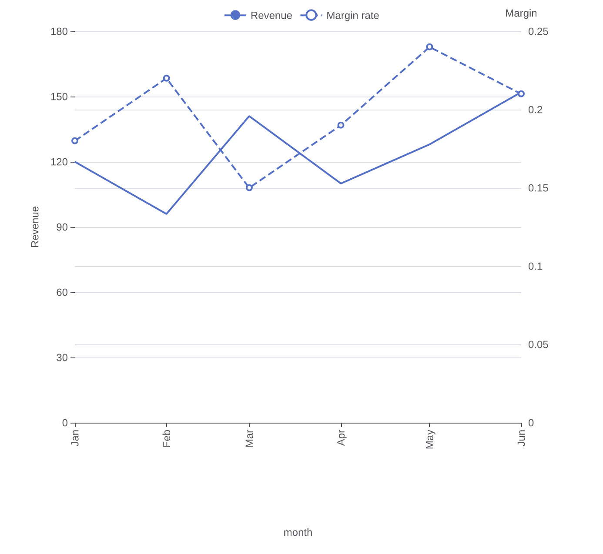

# Native ECharts options

Flint's semantic layer covers the common cases. ECharts is much larger than any
channel set: a second value axis, a bar and a line in one chart, `markLine` /
`markArea`, `dataZoom`, `visualMap`, axis and tooltip formatters, per-series
`areaStyle`, custom `grid`s — the list does not end. Without a way to reach
those, a caller whose chart needs one of them has to costndon Flint and
hand-write the option, and loses the semantic layer it came for.

`chart_spec.echarts` is that way. It is a **native escape hatch, not a second
semantic language**: nothing in it decides anything about the data. It merges
what you state onto the option Flint compiled, and — optionally — binds extra
series to columns so a native series does not mean re-serialising your rows.

```jsonc
{
  "chartType": "Line Chart",
  "encodings": { "x": { "field": "month" }, "y": { "field": "revenue" } },
  "echarts": {
    "legend": { "show": true, "top": 6 },
    "yAxis": [{ "name": "Revenue" }, { "name": "Margin", "position": "right" }],
    "series": [
      { "name": "Revenue", "lineStyle": { "width": 2 } },
      { "type": "line", "field": "margin", "name": "Margin rate", "axis": "right", "lineStyle": { "type": "dashed" } }
    ]
  }
}
```

That spec compiles to a real dual-axis chart: Flint's own series stays on the
left axis, and the added `margin` series lands on a right-hand axis — no
template support required, and no change to the encodings.

<p align="center">
  
</p>

## Where it goes

Inside `chart_spec`, beside `encodings` and `chartProperties`. It is
backend-scoped by name and ignored by the other assemblers, the same way
`theme_spec` is Vega-Lite's. Passing it to a Vega-Lite build is harmless and
has no effect.

The patch is applied **last** — after the layout pass and the template's own
post-processing — so what you state is authoritative over what Flint decided
above it.

## Merge semantics

The whole contract is four rules:

| Patch value | Result |
|---|---|
| Plain object | merged key by key, recursively |
| Array of plain objects (`series`, `xAxis`, `yAxis`, …) | merged **element-wise by index**; entries past the end are appended |
| Any other array (a series' `data`, a `color` list) | **replaces** the compiled value |
| Anything else (scalar, `null`) | replaces |

An array of plain objects merging by index is what makes a single series
addressable: `"series": [{}, { "lineStyle": { "type": "dashed" } }]` restyles
the second series without restating the first. The base series keeps its
`data`; only what you name changes.

An empty array says nothing, and never wipes a value Flint just built.

Keys beginning with `_` are reserved by Flint (`_warnings`, `_pivot`,
`_viewports`, …). They are dropped, with an `info` warning in `_warnings`.

## Binding a series to columns

A series entry may carry `field` / `fields` instead of `data`:

| Key | Meaning |
|---|---|
| `field` | one column → one series; `data` is read from the rows as `[category, value]` pairs |
| `fields` | several columns → one series each, named after the column |
| `categoryField` | which column to pair against (defaults to the chart's own x field) |
| `axis` | `"right"` puts the series on a right-hand value axis |

Entries that bind a column are **added**; entries that do not are **patched by
index**. Both intents can appear in one array, and the position of an added
series among the patches does not matter — only its order among the additions.

`"axis": "right"` is sugar: the series gets `yAxisIndex: 1`, a right-hand value
axis is created if the chart does not have one, and the grid reserves room for
it. If you patch `yAxis` yourself, yours wins.

Binding is skipped — with a warning — when the chart has no category field
(a pie, say: the series then gets plain values) or when the chart is faceted
(one option holds every panel, so "the" category axis is ambiguous; pass
explicit `data` there).

## What it does not do

- It does not add channels. `chart_spec.encodings` still only accepts the
  channels a template declares; anything beyond that reaches ECharts through
  this hatch, not through a new channel.
- It does not validate ECharts' own option vocabulary. An unknown key is
  passed through and ECharts ignores it, exactly as it would in a hand-written
  option.
- It does not create data. A native series can bind existing columns; it
  cannot compute new ones. Aggregate upstream (in SQL, or with
  `chartProperties.aggregate`) and bind the result.
- Only the ECharts backend reads it. Chart.js, Plotly, Excel, and Vega-Lite
  builds ignore the key.

## Related

- [ECharts chart reference](./reference-echarts.md) — channels and
  `chartProperties` per chart type.
- [API reference](./api-reference.md) — `ChartAssemblyInput` and
  `chart_spec`.
