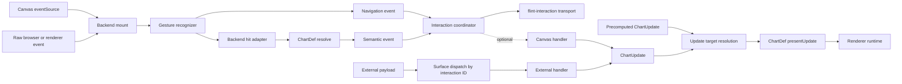
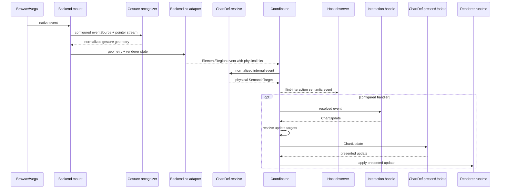
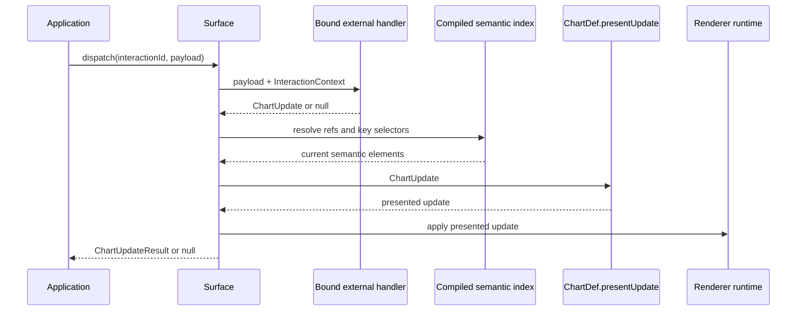
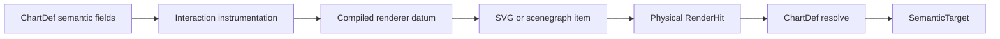
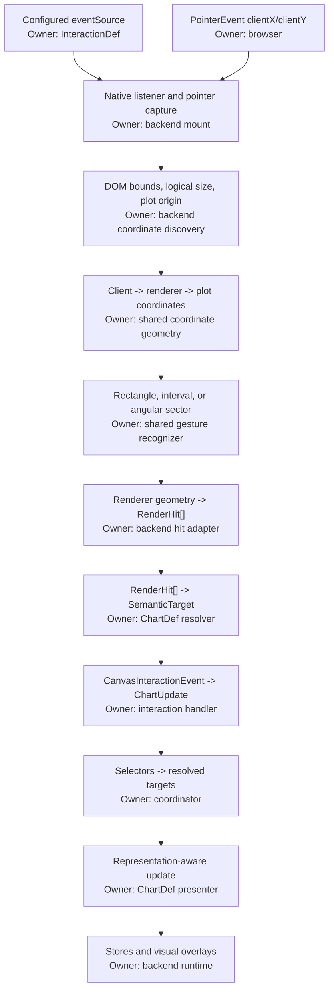

# Interaction Event And Update Architecture

## Status

The canvas-acquisition, semantic-resolution, external-dispatch, preset, and unified
`ChartUpdate` paths are implemented. Vega-Lite emits public `CanvasInteractionEvent`
payloads and renders declarative updates. Canvas gesture state owns preview, commit,
and cancel behavior; external payloads invoke their bound handlers directly. Complete
presentation-property coverage and semantic interaction runtimes for other backends
remain planned.

## Goal

Separate interaction input, semantic resolution, handling, chart updates, and renderer presentation so that:

- canvas gestures and external application payloads invoke different handler contracts
    that produce the same update language;
- resolved canvas interactions are useful whether or not a built-in update runs;
- chart resolution reports only the physical semantic unit that produced an internal event;
- an interaction handler decides what semantic cohort to act on, including chart-specific behavior;
- chart definitions decide how semantic updates should be presented;
- runtimes apply presented updates mechanically;
- resolved semantic events are emitted to the host application with stable chart identity;
- applications can bind transport-neutral payload handlers without understanding
    renderer structure;
- precomputed renderer-neutral updates remain directly applicable as chart state.

## Developer Quick Start

Configure a canvas interaction with a reusable handler:

```ts
import {
    buildInteractiveChart,
    clickTrigger,
    externalInteraction,
    type CanvasInteractionDef,
} from 'flint-chart/interactive';

const selectCountry: CanvasInteractionDef = {
    id: 'select-country',
    eventSource: clickTrigger,
    handle: (event) => event.target ? {
        id: 'country-selection',
        ops: [{
            op: 'set-style',
            targets: [event.target],
            value: { state: 'emphasized', mutedOpacity: 0.25 },
        }],
    } : null,
};

const surface = buildInteractiveChart(container, input, {
    backend: 'vegalite',
    interactions: [selectCountry],
});

await surface.ready;
```

Bind application input independently of its transport:

```ts
const countryPicker = externalInteraction<{ country: string; selected: boolean }>({
    id: 'country-picker',
    handle: ({ country, selected }) => ({
        id: 'country-selection',
        ops: [{
            op: 'set-style',
            targets: selected ? [{ select: { key: { Country: country } } }] : [],
            value: { state: selected ? 'emphasized' : 'normal' },
        }],
    }),
});

const surface = buildInteractiveChart(container, input, {
    backend: 'vegalite',
    interactions: [countryPicker],
});

const result = await surface.dispatch('country-picker', {
    country: 'Japan',
    selected: true,
});

if (result && result.status !== 'applied') {
    console.warn(result.unresolvedTargets, result.unsupportedOps);
}
```

The selector is equality-only and each field must be declared by the compiled ChartDef.
Use an event-derived target when exact visual identity matters. Always inspect
`ChartUpdateResult` for externally supplied selectors because current data may no longer
contain the requested key.

The surface API is intentionally small:

| API | Purpose |
|---|---|
| `flint-interaction` event | Receive resolved canvas actions |
| `applyUpdate(update)` | Apply precomputed retained chart state by ID |
| `setUpdates(updates)` | Replace the retained update collection |
| `clearUpdate(id)` | Remove one retained update |
| `dispatch(interactionId, payload)` | Invoke an external handler and report its update result |
| `destroy()` | Remove listeners, renderer state, and DOM |

## Cross-chart routing

Emission is universal and distributed: `flint-interaction` bubbles from every configured
canvas interaction. Acceptance is explicit: each destination registers an external
interaction, and the application chooses destinations by dispatching its semantic payload.

```ts
dashboard.addEventListener('flint-interaction', (nativeEvent) => {
    const detail = (nativeEvent as CustomEvent<FlintInteractionEventDetail>).detail;
    const selection = deriveSelection(detail.event);

    for (const [chartId, surface] of dashboardSurfaces) {
        if (chartId === detail.chartId) continue;
        void surface.dispatch('linked-selection', { selection });
    }
});
```

Charts do not automatically consume events from neighboring charts. The dashboard,
story, or editor owns its cross-chart topology and semantic mapping. This coordinator is
scoped to that composition, not a global singleton. Each destination's
`externalInteraction({ id: 'linked-selection', handle })` maps the shared payload to
targets meaningful for that chart.

## Pipeline



The normative ownership boundary is:

| Stage | Owner | Input | Output | Must not own |
| --- | --- | --- | --- | --- |
| 1. Declare interpretation | Interaction `eventSource` | Author configuration | Element, region, or navigation source descriptor | Renderer geometry or semantic meaning |
| 2. Capture gesture | Backend mount + shared recognizer | Source descriptor and native events | Renderer-neutral point or region geometry | Gesture inference, semantic meaning, or chart updates |
| 3. Resolve physical hits | Backend hit adapter | Normalized geometry and renderer state | `RenderHit[]` | Chart-type meaning or handler decisions |
| 4. Resolve semantics | ChartDef resolver | Gesture context and `RenderHit[]` | Physical `SemanticTarget` | Handler decisions or cohort expansion |
| 5. Coordinate | Interaction coordinator | Resolved semantic or navigation event | Canonical outbound event and optional handler invocation | Chart-specific semantic meaning |
| 6. Decide update | Bound canvas or external handler | Resolved canvas event or opaque external payload | `ChartUpdate` | Renderer-specific presentation |
| 7. Resolve update | Coordinator + compiled semantic index | Public refs/selectors | Current semantic elements | Product relationships or approximate matching |
| 8. Present update | ChartDef `presentUpdate` | `ChartUpdate` | Chart-specific presented update | Renderer mutation |
| 9. Apply update | Renderer runtime | Presented update | Renderer state | Semantic inference or handler decisions |

Navigation deliberately takes a shorter resolution path. It controls a continuous
viewport rather than a semantic chart element, so it does not fabricate `RenderHit[]`
or a `SemanticTarget`; the coordinator still emits its normalized public event before
invoking an optional handler.

ChartDef resolves and presents chart semantics. It does **not** own DOM transport. The coordinator emits resolved semantic events externally because transport identity (`chartId`, `interactionId`, and transaction metadata) is surface-level state, not chart semantics.

An internal event follows this call sequence:



An external payload follows a shorter input path while sharing update processing:



## Backward Semantic Resolution

Internal interaction depends on a reversible path from authored chart semantics to rendered geometry and back. SVG nodes and Vega scenegraph items know about marks, bounds, and renderer data, but they do not inherently know which Flint semantic element they represent. Flint establishes that connection automatically during chart assembly, before rendering.

This instrumentation is compiler-owned. The chart author declares semantic fields and interactions; they do not create hidden key columns, maintain selection parameters, or wire renderer predicates into every mark. The compiler derives the required identity metadata from the ChartDef and instruments generated marks consistently. By comparison, a direct Vega-Lite workflow generally requires the spec author to define selection parameters and connect them to mark encodings or transforms. Flint keeps that renderer bookkeeping out of the authored chart, so an agent or application can reason in terms of semantic elements rather than reconstructing scenegraph identity itself.

At a high level, this resembles automatic differentiation: PyTorch instruments a forward computation so its runtime can traverse it backward without requiring users to maintain derivatives by hand. Flint instruments forward chart compilation so its runtime can traverse a rendered hit backward without requiring users to maintain selection keys or renderer-to-data mappings by hand. Flint performs semantic resolution rather than numerical differentiation, but the shared architectural idea is automatic, system-maintained provenance.



### Instrumentation

For each interactive mark, the compiler derives a stable key from the ChartDef's semantic identity fields and writes it into the renderer datum as `__flint_interaction_key`. The key survives Vega-Lite compilation and is therefore available on the rendered scenegraph item. It is private generated state, not part of the user's data contract.

Generated semantic representations may also declare provenance. A generated text label declares:

```ts
interface InteractionProvenance {
    role: 'text-label';
    identity: 'inherit' | { fields: readonly string[] };
    presentation: 'on-mark' | 'independent';
}
```

`identity` determines which semantic key the representation receives. Most value labels inherit the mark identity. An aggregate label can name a smaller field set; for example, a rose category label may identify only its category even though each arc is identified by category and series.

Instrumentation lowers the generation-time provenance into runtime datum metadata:

```ts
__flint_interaction_key   // which semantic data identity this item represents
__flint_interaction_role  // which kind of representation produced the hit
```

Generation-time provenance is removed before Vega compilation. The lowered datum fields are the bridge through compilation because Vega preserves them on scenegraph items.

### Physical Hit Normalization

The renderer trigger locates the SVG or scenegraph item under a pointer, reads its instrumented datum, and emits a renderer-neutral `RenderHit`. The trigger may report mark type, mark name, bounds, path geometry, and representation role, but it does not assign chart meaning.

Text is deliberately inert unless its datum carries the `text-label` role. This prevents titles, axis text, and unrelated annotations from becoming selectable merely because they share chart data.

The interaction key and role answer different questions:

| Metadata | Question | Used for |
| --- | --- | --- |
| `__flint_interaction_key` | Which rendered primitive is this? | Private stable lookup for backend presentation updates |
| `__flint_interaction_role` | Which representation of that identity was hit? | Choosing representation-aware resolution behavior |

### ChartDef Resolution

The normalized role and `RenderHit[]` are passed to the owning ChartDef resolver. The resolver converts renderer facts into a `SemanticTarget`; this is the backward boundary where renderer-specific items become semantic elements.

For a direct mark, resolution commonly maps each hit key to one `SemanticElement`. A representation can require different resolution even when it refers to related data. For example, clicking one rose arc resolves that arc, while clicking a `text-label` for January can resolve the January label identity to every arc represented by that aggregate label.

The role is resolution context rather than semantic identity. Private render keys remain in a backend sidecar so the ChartDef and applications do not need to carry renderer identity. Normal marks can use the default `mark` role, while representations such as `text-label` require an explicit role when their backward mapping differs.

The result contains no SVG node or Vega scenegraph item:

```ts
interface SemanticTarget {
    visual: {
        kind: 'mark' | 'path' | 'region' | 'widget' | 'handle' | 'legend';
        role: string;
    };
    elements: readonly SemanticElement[];
}

interface SemanticElement {
    value: Record<string, unknown>;
    records?: readonly Record<string, unknown>[];
}
```

`value` is the represented transformed or aggregated chart value. It may contain derived
semantics such as stack or path endpoints. `records` are authored source rows only when
the runtime can prove their lineage; they are omitted rather than replaced with renderer
tuples when provenance is unavailable. Exact render identity is backend-private and can
map one semantic element to one or many rendered primitives.
After this boundary, presets and applications operate on semantic elements. They do not
inspect renderer geometry to rediscover meaning.

## Acquisition Events

Backends normalize physical input into these internal acquisition events. External
payloads do not enter this acquisition language because callers have already identified
the interaction and its semantic payload.

```ts
type InteractionPhase = 'start' | 'preview' | 'commit' | 'cancel';

interface ElementInteractionEvent {
    type: 'element';
    phase: 'preview' | 'commit' | 'cancel';
    hits: readonly RenderHit[];
    point?: PlotPoint;
    modifiers?: InteractionModifiers;
}

interface RegionInteractionEvent {
    type: 'region';
    phase: InteractionPhase;
    region: PlotRect | PlotPolygon;
    hits: readonly RenderHit[];
    match: 'intersect' | 'contain';
    modifiers?: InteractionModifiers;
}

interface NavigationInteractionEvent {
    type: 'navigation';
    phase: InteractionPhase;
    operation: 'pan' | 'zoom' | 'reset';
    axes: 'x' | 'y' | 'xy';
    delta?: PlotPoint;  // plot fractions
    factor?: number;
    anchor?: PlotPoint; // plot fractions
}

```

`Element` and `Region` describe physical chart input at the geometry level. They may contain coordinates, region geometry, rendered mark metadata, and data records in `RenderHit[]`, but they do not claim semantic meaning. `Navigation` describes a viewport transform in plot fractions and likewise carries no semantic target. External payloads bypass acquisition events and enter through their bound external handler.

## Semantic Resolution

Only internal Element and Region events are resolved. The owning ChartDef resolver is observational and data-driven. It answers what physical visual/data unit produced the event, not what should happen because of it.

```ts
interface SemanticInteractionEvent {
    type: 'semantic';
    source: 'element' | 'region';
    phase: InteractionPhase;
    target: SemanticTarget | null;
    point?: PlotPoint;
    region?: PlotRect | PlotPolygon;
    modifiers?: InteractionModifiers;
}
```

For a dumbbell, hover resolves the physical endpoint under the pointer. A direct click resolves
the complete category unit with its connector first and both endpoints following, so emphasis and
annotation share one semantic subject.

After resolution, the coordinator constructs the semantic event, emits it through
`flint-interaction`, and invokes the matching interaction handler when configured. External
emission is therefore downstream of ChartDef resolution but is not performed by
ChartDef and does not depend on a chart update.

The current `SemanticInteractionEvent` and `NavigationInteractionEvent` are internal
ingredients. Outbound transport uses one public resolved event shape:

```ts
interface CanvasInteractionEvent {
    action: CanvasInteractionAction;
    phase: InteractionPhase;
    operation?: InteractionOperation;
    geometry: {
        plot?: PlotGeometry;
        domain?: DomainGeometry;
    };
    target: SemanticTarget | null;
    dropTarget?: SemanticTarget | null;
    modifiers?: InteractionModifiers;
}
```

`action` reports the normalized semantic action, such as `click-element`,
`click-legend`, `brush-x`, `pan-viewport`, or `inspect-xy`. `geometry.plot` reports
renderer-neutral canvas geometry; optional `geometry.domain` reports scale-inverted
values. `target` reports the semantic object and data provenance. Drag-and-drop also
uses `dropTarget` for its destination.

Current Vega-Lite acquisition emits element, legend, region/brush, and navigation
actions. The broader action union reserves the reviewed shape for inspection,
drag-and-drop, keyboard, axis, facet, and annotation recognizers as they are implemented.
`geometry.domain` is currently omitted; applications must treat it as optional.

The coordinator emits meaningful lifecycle points: `start`, repeated `preview`, final
`commit`, and `cancel`. High-frequency pointer previews may be coalesced to animation
frames, but they are not reduced to commit-only output.

## Interaction Handlers

Canvas and external definitions bind different inputs to the same output language.
A canvas handler consumes a resolved canvas event; an external handler consumes its
application-defined payload. Both may return one `ChartUpdate`.

```ts
interface CanvasInteractionDef {
    readonly id: string;
    readonly eventSource: InteractionEventSource;
    handle?(
        event: CanvasInteractionEvent,
        context: InteractionContext,
    ): ChartUpdate | null;
}

interface ExternalInteractionDef<TPayload> {
    readonly id: string;
    readonly external: true;
    handle(payload: TPayload, context: InteractionContext): ChartUpdate | null;
}

type InteractionDef = CanvasInteractionDef | ExternalInteractionDef;
```

Canvas definitions have two declarative halves:

1. `eventSource` declares **what input to capture and how to interpret it physically**. The same native `pointerdown -> pointermove -> pointerup` stream becomes a free rectangle for `select()`, an axis-constrained interval for `brushX()` or `brushY()`, and an angular sector for `brushAngle()`.
2. Optional `handle()` declares **what update JSON to produce** after normalization.
    Target-bearing events first pass through ChartDef semantic resolution. The handler
    consumes the same `CanvasInteractionEvent` emitted to applications and returns a
    `ChartUpdate` containing renderer-neutral `set-style`, `set-annotation`,
    `set-viewport`, or `set-order` operations.

The backend mount reads `eventSource`; it does not infer a gesture from pointer motion. It installs the required native listeners, supplies renderer coordinates and hit testing, and runs the recognizer requested by the interaction. This keeps an identical drag stream deterministic and author-controlled.

Transient gesture guides belong to that mount lifecycle, not to `ChartUpdate`. They visualize
the gesture's current geometry and clear on cancel, leave, or destroy. Disabling or styling a
guide never changes acquisition or the emitted semantic event:

```ts
inspect({
    mode: 'xy',
    guide: { style: { color: '#47525c', opacity: 0.5, width: 1 } },
});

brushX({
    guide: { style: { fill: '#2563eb', fillOpacity: 0.1 } },
});

lassoSelect({ guide: false });
```

Inspect lines, Cartesian regions, angular sectors, and lasso paths use the shared
renderer-neutral gesture-guide styles. Retained guides such as reference lines instead belong
to chart presentation state and may be created by effects through chart updates.

Chart-specific action processing belongs in the handler. For example, ranged-dot region targets
are expanded to complete category units before producing a `set-style` update. Direct ranged-dot
clicks already resolve to the complete dumbbell in the owning ChartDef.

The coordinator always emits a resolved canvas event and invokes `handle()` only when
present. External dispatch does not emit or synthesize a canvas event. Updates returned
by either handler enter the same target-resolution, presentation, and renderer pipeline.
This creates four public layers:

1. predefined observers that acquire and resolve common canvas actions;
2. external definitions binding application payloads to update policies;
3. direct renderer-neutral `ChartUpdateOp` JSON for precomputed state;
4. presets joining common canvas actions to updates.

Presets compose predefined triggers from `interactive/triggers.ts` with an optional handler.
They refer to reusable descriptors such as `clickTrigger` and `rectangleTrigger()`
rather than defining event acquisition inline. They are convenience APIs, not
architectural primitives or the primary extensibility model.

## Triggers

`interactive/triggers.ts` owns event-source contracts and built-in trigger descriptors.
`interactive/language/events.ts` owns the shared interaction-event vocabulary. A backend
owns renderer-specific event normalization and realizes trigger descriptors against its
native event and coordinate systems.

Type colocation does not change production ownership: chart triggers produce Element,
Region, and Navigation normalized events. The coordinator produces
`SemanticInteractionEvent` only after ChartDef resolution. Its type lives in `events.ts`
so the full canvas event vocabulary has one definition site. External payloads bypass
this acquisition vocabulary and enter through their bound external interaction handler.

Flint provides common triggers for element activation, hover preview, rectangle drag,
and navigation:

```ts
clickTrigger
hoverTrigger
rectangleTrigger('intersect' | 'contain')
xBrushTrigger('intersect' | 'contain')
yBrushTrigger('intersect' | 'contain')
angularBrushTrigger('intersect' | 'contain')
navigationTrigger()
```

### Cartesian navigation

`navigate()` combines drag pan, wheel or two-finger pinch zoom, and reset as one viewport handler. Pinch zoom is anchored at the moving midpoint between the two touches. ChartDefs opt in explicitly with `navigation.axes`; assembly then intersects that capability with resolved quantitative or temporal x/y encodings. An explicitly requested unsupported axis is an error. With `axes: 'available'`, categorical axes are omitted automatically.

The gesture reports incremental pan deltas and zoom anchors as plot fractions. The
renderer reduces them to absolute `set-viewport` domains using percentage-based guards:

```ts
navigate({
    axes: 'available',
    domainGuard: {
        minVisibleFraction: 0.02,
        maxVisibleFraction: 1,
        overscrollFraction: 0,
    },
})
```

The backend scale adapter owns conversion between these normalized fractions and linear, temporal, or logarithmic scale domains. Guards are relative to the initial domain: minimum and maximum visible fractions bound zoom, while overscroll controls how far the current domain may move beyond its allowed extent. Vega realizes the result through explicit `domainRaw` signals, so viewport mutation remains separate from semantic selection stores.

V1 requires top-level continuous Cartesian scales. Faceted charts are excluded because each child view needs scoped scale ownership, and geographic/map navigation is excluded because projected coordinates require a projection-aware adapter rather than Cartesian domain arithmetic.

`xBrushTrigger()` and `yBrushTrigger()` emit region events constrained to one axis. An X brush spans the full plot height; a Y brush spans the full plot width. The trigger performs this projection in plot geometry and reports physical hits. It does not inspect chart orientation or invert scales.

The corresponding `brushX()` and `brushY()` presets apply semantic emphasis to the elements resolved from those hits. This is element-based brushing; domain-range inversion for linked charts remains a separate ChartDef resolver capability.

`angularBrushTrigger()` emits an annular-sector region centered on a rendered polar chart. Pointer angles use the renderer's convention: zero is 12 o'clock and positive angles proceed clockwise. The runtime unwraps pointer motion continuously, so a drag can cross the $0/2\pi$ seam or proceed counterclockwise without jumping to the complementary sector.

The corresponding `brushAngle()` preset is accepted only when the owning ChartDef declares angular-region support. Pie, donut, and rose charts opt in; Cartesian ChartDefs reject the interaction during planning. Arc intersection and containment are evaluated from rendered `startAngle`, `endAngle`, `innerRadius`, and `outerRadius` geometry, while the existing ChartDef resolver retains ownership of semantic identity.

Brushes support two lifecycle modes:

```ts
brushX({ mode: 'ephemeral' }) // default: overlay exists only during the drag
brushY({ mode: 'stateful' })  // committed overlay remains editable
brushAngle()                   // ephemeral polar sector
```

Select and Cartesian brushes share the rectangular region gesture engine. `select()` configures a free two-dimensional ephemeral rectangle. A stateful axis brush retains its committed interval, allows dragging the body to move it, allows dragging either edge to resize it, and clears on an outside click or Escape. Angular brushing is currently ephemeral; editable wrapped-angle handles require a separate circular interaction model. Region events identify transitions with `create`, `move`, `resize-leading`, `resize-trailing`, and `clear` operations. This state and its interaction chrome are owned per chart surface by the trigger runtime; preset handlers remain stateless.

The folder is organized as:

- `index.ts`: event-source contracts and built-in trigger definitions.
- `events.ts`: shared geometry, phases, normalized input event types, and the post-resolution semantic event type.

The public triggers are exported from `flint-chart/interactive`. The source contract remains open so applications can define custom sources.

### Gesture and backend ownership

Gesture recognition is shared interaction infrastructure; binding a gesture to rendered chart objects is backend infrastructure.

The interaction is authoritative about gesture intent:

```text
select()       -> cartesian + xy    -> free rectangular selection
brushX()       -> cartesian + x     -> horizontal interval
brushY()       -> cartesian + y     -> vertical interval
brushAngle()   -> angular           -> polar angular sector
navigate()     -> cartesian axes    -> pan / zoom viewport transform
```

The backend mount is authoritative about realization:

```text
configured eventSource + native pointer stream
    -> matching recognizer
    -> normalized physical region
    -> renderer-specific physical hits
```

It must not reinterpret an `x` brush as a free selection, choose angular behavior merely because the chart contains arcs, or guess among configured operations from pointer trajectory.

`interactive/` owns:

- renderer-neutral pointer-session state such as angular sweep accumulation and interval transitions;
- Cartesian and angular gesture math;
- renderer-neutral regions such as `PlotRect`, `PlotPolygon`, and `PlotAngularSector`;
- presets that translate resolved semantic targets into `ChartUpdate` JSON.

A backend owns:

- discovering its plot coordinate space and converting client points into it;
- finding renderer-specific frames such as the center and radii of a polar plot;
- mapping normalized regions to physical rendered hits;
- normalizing renderer element and legend events;
- mounting the recognizer declared by `eventSource` against its native event system;
- owning pointer capture and drawing backend-aligned gesture chrome;
- applying updates to renderer stores and drawing representation-specific presentation.

For Vega-Lite, `vegalite/interactions/` is the composition boundary. It wires shared gesture recognizers to Vega coordinate discovery, scenegraph hit testing, ChartDef semantic resolution, interaction handlers, and Vega presentation. Shared gesture modules must not import Vega or inspect scenegraph items.

The stages are therefore distinct:



Visual gesture feedback takes the reverse spatial path: the backend sends plot geometry through the shared plot-to-client and client-to-layout transforms, then draws it in its DOM, canvas, or SVG overlay.

The implementation follows that boundary:

```text
interactive/
    geometry/
        angular.ts             # angular intervals and sector paths
        coordinate-space.ts    # renderer-neutral coordinate transforms
    gestures/
        angular-region.ts      # angular pointer-session state
        cartesian-region.ts    # Cartesian projection and interval transitions
        navigation.ts          # pan sessions and wheel normalization
    presets/                 # source and handler combinations
    triggers.ts              # renderer-neutral source descriptors
    language/                # interaction event and chart update contracts

vegalite/interactions/
    contracts.ts             # Vega interaction plan contracts
    stores.ts                # Vega selection and hover stores
    compile.ts               # Vega-Lite instrumentation and Vega store injection
    hit-adapter.ts           # Vega coordinates, scenegraph traversal, and physical hits
    runtime.ts               # resolve -> handle -> present -> apply coordinator
    gestures/
        region.ts              # Vega mounting for rectangle, axis, and angular drags
        navigation.ts          # Vega mounting for pan, wheel zoom, and reset
    navigation-scale.ts        # Vega domain guards and signal updates
    presentation/
        focus-overlay.ts       # path focus and selection boundaries
        annotation-overlay.ts  # annotation candidate search, wrapping, and drawing
```

Vega interaction code imports its concrete owner directly. Compile instrumentation comes from `vegalite/interactions/compile.ts`, runtime coordination from `runtime.ts`, and physical adaptation from `hit-adapter.ts`. There is intentionally no cross-layer interaction barrel: narrow imports make ownership violations visible during review.

A custom source may register listeners and emit normalized events. Renderer-specific mounting code may additionally compute renderer geometry and inspect rendered marks. Neither source descriptors nor mounts may resolve semantic targets, contain chart-type behavior, or construct chart updates.

### Target feedback

Assisted pointer and keyboard targeting share a transient target indicator and a floating semantic tooltip. Keyboard arrows move the indicator, apply the active hover styling, and emit `focus-element` through the `keyboard-targeting` interaction ID even when no click preset is configured. Enter or Space invokes any configured click presets. The tooltip uses the compiled pointer-hover fields, stays clear of the active mark, may extend beyond the chart canvas, and scrolls with the chart.

Eligible element presets use modest assisted pointer targeting by default: click, annotation,
context, and double activation use an 8-pixel acquisition radius, hover uses 6 pixels, and long
press uses 12 pixels. Region selection, brushing, navigation, and element dragging never use
assisted acquisition. Set `assistedTargeting: false` to require direct hits globally, or provide
`maxDistance` as a hard override for all eligible presets. Indicator and detail feedback remain
opt-in:

```ts
buildInteractiveChart(container, input, {
    backend: 'vegalite',
    interactions: [clickHighlight({ targets: ['mark', 'legend', 'discreteAxis'] }), axisHighlight()],
    assistedTargeting: {
        maxDistance: 10,
        indicator: true,
        details: { fields: ['country', 'value'], maxRows: 4 },
    },
    keyboardTargeting: true,
});
```

`axisHighlight()` treats native categorical axis ticks as semantic controls. The compiler maps each Vega scale back to its authored field, and the runtime associates a tick with represented mark keys. Quantitative and temporal ticks remain inert until a nearest-value or interval policy is specified.

## Update Language

Presets and applications produce one renderer-neutral `ChartUpdate` format. There is no
separate request operator, resolved operator, or renderer-only operator language:

```ts
interface ChartUpdate {
    id: string;
    ops: readonly ChartUpdateOp[];
}

type ChartUpdateOp =
    | { op: 'set-style'; targets: readonly UpdateTarget[]; value: StyleSpec }
    | { op: 'set-annotation'; target: UpdateTarget; value: AnnotationSpec | null }
    | { op: 'set-viewport'; axes: 'x' | 'y' | 'xy'; value: { x?: Domain; y?: Domain } }
    | {
        op: 'set-order';
        scope: 'category' | 'series' | 'facet';
        field: string;
        values: readonly unknown[];
    };

interface StyleSpec {
    visible?: boolean;
    opacity?: number;
    fill?: string;
    stroke?: string;
    strokeWidth?: number;
    state?: 'normal' | 'focused' | 'emphasized' | 'muted';
    mutedOpacity?: number;
}
```

Operators are plain JSON. Presets and applications construct object literals directly;
there are no trivial operator factory functions.

The renderer has two inputs:

```text
chart + updates -> rendered chart
```

`chart` is the immutable base specification. `updates` describes what the chart should
display and is suitable for serialization and static composition. The renderer does
not know whether an interaction is previewing, committing, or reverting an update.

Interaction state owns that lifecycle. During a gesture, the interaction controller may
compose its private preview over retained updates before rendering. Commit retains the
result; cancel drops the preview and renders the retained collection again. Preview
state is not part of the chart API or update language.

The surface can replace the retained collection atomically:

```ts
await surface.setUpdates(updates);
```

`applyUpdate(update, { composition: 'auto' })` replaces one retained update by ID, while
`clearUpdate(id)` removes that retained update. The default `auto` policy composes all
retained updates in insertion order: presentation selections accumulate, while later
annotation, viewport, and order operations take precedence. The policy is explicit so
future composition modes can extend the API without changing this default behavior.

Relative gesture data is not update state. Pan deltas, zoom factors, toggle modifiers,
and drag positions are reduced by interaction state into absolute `set-viewport`,
`set-style`, or `set-order` values. Cancelling a gesture requires no inverse
chart command: the interaction drops its preview and sends the prior effective updates.

Targets may be exact event-derived refs or unresolved equality selectors:

```ts
type UpdateTarget =
    | SemanticTargetRef
    | {
        select: {
            key: Record<string, unknown>;
            visual?: Partial<SemanticTarget['visual']>;
        };
    };
```

Selectors accept only ChartDef-declared semantic fields. At runtime they are resolved to
the same `SemanticTargetRef` shape; the surrounding `ChartUpdateOp` does not change.

ChartDefs may enrich an operator without changing its kind. For example,
`set-annotation` can begin with text only and gain meaningful connection candidates in
its `value`:

```ts
interface AnnotationCandidate {
    connection: 'center' | 'top' | 'right' | 'bottom' | 'left'
        | 'value-end' | 'value-side' | 'segment-midpoint' | 'outer-radial';
    valueAxis?: 'x' | 'y';
    crossSide?: 'start' | 'end';
    valueInset?: number;
    anglePreference?: 'normal' | 'oblique';
    textAlign?: 'left' | 'center' | 'right';
    connector?: 'line' | 'none';
    maxWidth?: number;
    maxDistance?: number;
    priority?: number;
}
```

The renderer reconstructs effective state from the two arrays and updates Vega stores,
signals, and overlays in one dataflow run. It does not transform or recompile the base
chart for each preview. Current Vega-Lite coverage includes emphasized/focused target
state, one effective annotation, exact continuous viewport domains, and category order.
Visibility and direct ink properties, multiple simultaneous annotations, and series or
facet order remain implementation work within the existing four-operator grammar.

When a caller already has a complete `ChartUpdate`, it may bypass interaction handling
and apply that precomputed state directly:

```ts
const result = await surface.applyUpdate({
    id: 'external-country-selection',
    ops: [{
        op: 'set-style',
        targets: [{
            select: {
                key: { Country: 'Japan' },
                visual: { kind: 'mark' },
            },
        }],
        value: { state: 'emphasized' },
    }],
});
```

`ChartUpdateResult` reports applied, partially applied, or unsupported status plus
unresolved targets and unsupported ops. Missing keys are never silently rebound to
similar records.

Vega-Lite currently implements update application when the chart has a compiled
interaction plan. Other backends, or a Vega-Lite chart without interaction
instrumentation, return `status: 'unsupported'` rather than silently ignoring an update.

## External Interactions

External definitions bind an arbitrary application payload to the same renderer-neutral
update language used by canvas interactions:

```ts
const countryPicker = externalInteraction<{ country: string; selected: boolean }>({
    id: 'country-picker',
    handle: ({ country, selected }) => ({
        id: 'country-picker',
        ops: [{
            op: 'set-style',
            targets: selected ? [{ select: { key: { Country: country } } }] : [],
            value: { state: selected ? 'emphasized' : 'normal' },
        }],
    }),
});

await surface.dispatch('country-picker', { country: 'Japan', selected: true });
```

The transport may be React state, a DOM listener, a WebSocket, or another chart. Flint
looks up the definition by ID, passes the opaque payload and current interaction context
to its handler, then resolves and presents the returned `ChartUpdate`. Internal canvas
interactions additionally use backend gesture state machines to acquire start, preview,
commit, and cancel phases; external handlers do not synthesize those phases.

Payload typing is enforced at the `externalInteraction()` definition, while the
heterogeneous surface boundary accepts `unknown`. Canvas hit testing and navigation
domain calculation remain backend-assisted, and interaction definitions are mount-scoped.

## Outbound Events

Resolved internal events are emitted as a bubbling, composed DOM event named `flint-interaction`.

```ts
interface FlintInteractionEventDetail {
    chartId: string;
    interactionId: string;
    timestamp: number;
    transactionId?: string;
    event: CanvasInteractionEvent;
}
```

`chartId` identifies the source chart and remains stable for the surface lifetime. It is available on `surface.chartId` and as `data-flint-chart-id` on the surface element. `interactionId` identifies the configured interaction receiving the event.

`interactionId` identifies the configured observer that requested acquisition. It does
not imply that the observer has a handler.

The interaction coordinator, not ChartDef, owns this emission. Outbound emission does not depend on whether the preset returns a canvas update. External applications may coordinate text, tables, or other charts from semantic events while leaving the source chart unchanged.

## Identity

Callers should provide `chartId` when coordinating charts. Flint generates an ID when omitted. Re-rendering, viewport changes, and data updates do not change the resolved ID.

Chart identity belongs to the transport envelope, not `SemanticTarget`: semantic targets describe visual/data identity, while `chartId` describes event origin or dispatch destination.

## Facet linking

`facetBrushLink()` expands marks acquired in one facet to every available mark with the same authored semantic key:

```ts
facetBrushLink({ by: 'Country' });
facetBrushLink({ by: ['Country', 'Product'], brush: 'lasso' });
```

The key should be represented by a discrete positional channel, `detail`, or `color`. For a
quantitative scatter plot, prefer `detail` when identity should not alter appearance. Continuous
`x`, `y`, or `xy` values are not inferred as identities because measurements can change between
facets or collide. The preset emits the existing `set-style` operation; it does not filter data or
introduce facet-specific chart state.

`clickGroupFocus()` infers a chart-semantic partition, while
`clickGroupFocus({ groupBy: 'Country' })` uses explicit input-record field-key expansion. Plain strings
always name fields, so `groupBy: 'auto'` selects a field literally named `auto`.
`clickHighlight({ targets: ['mark'] })` remains local to the acquired mark.
`clickAnnotate()` remains local to the acquired mark.

For a custom stable partition, derive a field in the input data and name it with `groupBy`:

```ts
clickGroupFocus({ groupBy: 'Quadrant' });
```

This keeps grouping serializable and reusable by other chart semantics. Event-relative or otherwise
custom interaction logic belongs in a custom `handle`, which can emit the existing style updates.

`hoverGroupFocus({ groupBy: 'Country' })` provides the transient counterpart. Its preview
clears on pointer exit and does not replace retained click or brush state. Assisted acquisition
finds a nearby mark within the preset's default 6-pixel radius. Separately, the default 8-pixel
`tolerance` keeps the last resolved cohort stable across narrow gaps; set it to zero to disable
that gap retention.

## Click highlight targets

`clickHighlight()` emphasizes cohorts through one retained interaction. Its `targets`
option accepts `mark`, `legend`, and `discreteAxis`; omitted targets enable all three.
`legendToggle()` remains a separate visibility interaction.

Only compiler-declared discrete axis ticks are semantic cohorts; continuous ticks do not
implicitly become clickable selections. Continuous legend intervals remain resolvable labels.

## Interaction affordances

Canvas interactions declare cursor and hover affordances separately from their update handler.
Renderers combine those declarations for the semantic target under the pointer, so composed
presets share one discoverability policy instead of assigning cursors independently. Exact target
claims (`mark`, `legend-item`, or `axis-label`) take precedence over a plot-wide fallback; priority
resolves conflicts between equally specific claims. Active gesture states such as dragging and
resizing temporarily override the passive result.

Affordances do not perform chart updates. The interaction handler still owns semantic behavior,
and the renderer still owns presentation.

## Compatibility

Canonical helpers include:

- `clickHighlight()`
- `clickGroupFocus()`
- `clickAnnotate()`
- `facetBrushLink()`
- `hoverGroupFocus()`
- `legendToggle()`
- `select()`, `brushX()`, `brushY()`, and `brushAngle()`
- `navigate()`

All presets are implemented on the normalized event pipeline. Existing chart resolution and
`presentUpdate` hooks remain valid; chart-specific action expansion lives in interaction handlers.

The long-term built-in preset set should stay small: hover highlight, click
highlight/select, region or brush highlight, and guarded navigation. Specialized
annotation formatting, legend toggle/isolate, group expansion, linked views, tooltips,
and product relationships are primarily recipes composed from outbound events and
update factories. Compatibility helpers may remain without establishing a pattern of
adding every action-to-update combination as a preset.
