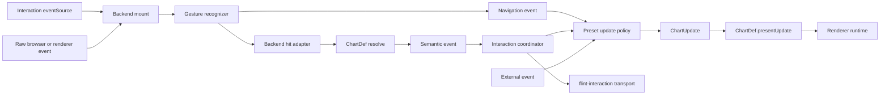
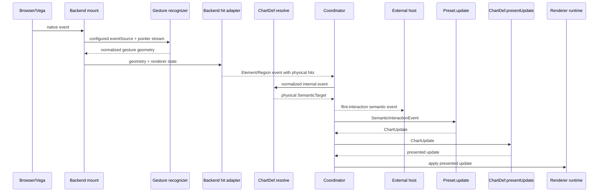
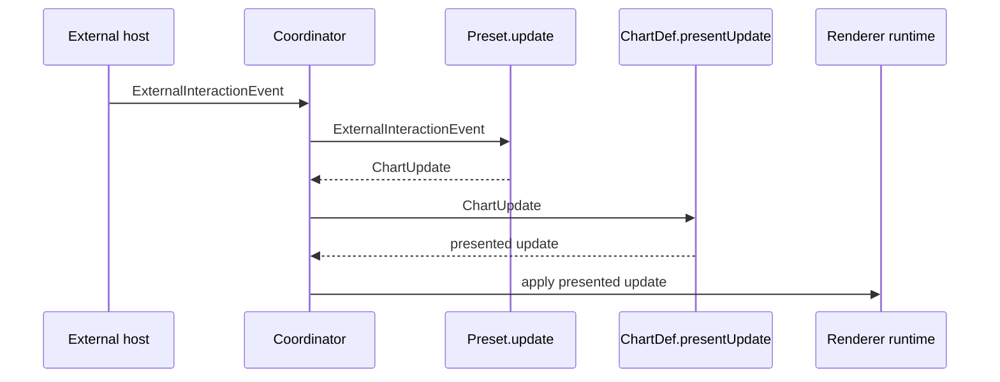
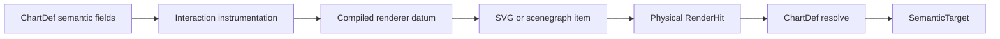
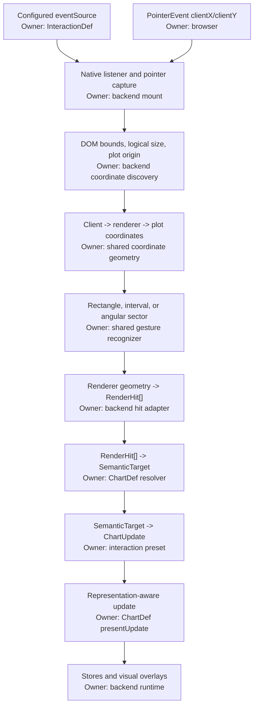

# Interaction Event Architecture

## Status

Implemented by the interactive surface, trigger modules, ChartDef semantics, presets, and Vega runtime.

## Goal

Separate interaction input, semantic resolution, policy, chart updates, and renderer presentation so that:

- canvas gestures and external application events can drive the same update language;
- chart resolution reports only the physical semantic unit that produced an internal event;
- interaction policy decides what semantic cohort to act on, including chart-specific behavior;
- chart definitions decide how semantic updates should be presented;
- runtimes apply presented updates mechanically;
- resolved semantic events can be emitted to the host application with stable chart identity.

## Pipeline



The normative ownership boundary is:

| Stage | Owner | Input | Output | Must not own |
| --- | --- | --- | --- | --- |
| 1. Declare interpretation | Interaction `eventSource` | Author configuration | Element, region, navigation, or external source descriptor | Renderer geometry or semantic meaning |
| 2. Capture gesture | Backend mount + shared recognizer | Source descriptor and native events | Renderer-neutral point or region geometry | Gesture inference, semantic meaning, or chart updates |
| 3. Resolve physical hits | Backend hit adapter | Normalized geometry and renderer state | `RenderHit[]` | Chart-type meaning or interaction policy |
| 4. Resolve semantics | ChartDef resolver | Gesture context and `RenderHit[]` | Physical `SemanticTarget` | Interaction policy or cohort expansion |
| 5. Coordinate | Interaction coordinator | Resolved semantic event | Outbound event and policy invocation | Chart-specific semantic meaning |
| 6. Decide update | Preset policy | Semantic or External event | `ChartUpdate` | Renderer-specific presentation |
| 7. Present update | ChartDef `presentUpdate` | `ChartUpdate` | Chart-specific presented update | Renderer mutation |
| 8. Apply update | Renderer runtime | Presented update | Renderer state | Semantic inference or policy |

Navigation deliberately takes a shorter path. It controls a continuous viewport rather than a semantic chart element, so its normalized event proceeds from the gesture recognizer to preset policy without fabricating `RenderHit[]` or a `SemanticTarget`.

ChartDef resolves and presents chart semantics. It does **not** own DOM transport. The coordinator emits resolved semantic events externally because transport identity (`chartId`, `interactionId`, and transaction metadata) is surface-level state, not chart semantics.

An internal event follows this call sequence:



An external event bypasses trigger geometry and semantic resolution:



External events bypass chart resolution because their payload already uses the vocabulary agreed between the source and interaction definition.

## Backward Semantic Resolution

Internal interaction depends on a reversible path from authored chart semantics to rendered geometry and back. SVG nodes and Vega scenegraph items know about marks, bounds, and renderer data, but they do not inherently know which Flint semantic element they represent. Flint establishes that connection automatically during chart assembly, before rendering.

This instrumentation is compiler-owned. The chart author declares semantic fields and interactions; they do not create hidden key columns, maintain selection parameters, or wire renderer predicates into every mark. The compiler derives the required identity metadata from the ChartDef and instruments generated marks consistently. By comparison, a direct Vega-Lite workflow generally requires the spec author to define selection parameters and connect them to mark encodings or transforms. Flint keeps that renderer bookkeeping out of the authored chart, so an agent or application can reason in terms of semantic elements rather than reconstructing scenegraph identity itself.

At a high level, this resembles automatic differentiation: PyTorch instruments a forward computation so its runtime can traverse it backward without requiring users to maintain derivatives by hand. Flint instruments forward chart compilation so its runtime can traverse a rendered hit backward without requiring users to maintain selection keys or renderer-to-data mappings by hand. Flint performs semantic resolution rather than numerical differentiation, but the shared architectural idea is automatic, system-maintained provenance.



### Instrumentation

For each interactive mark, the compiler derives a stable key from the ChartDef's semantic identity fields and writes it into the renderer datum as `__flint_interaction_key`. The key survives Vega-Lite compilation and is therefore available on the rendered scenegraph item. It is private generated state, not part of the user's data contract.

Generated semantic representations may also declare provenance. A generated text label declares:

```ts
interface InteractionProvenance {
    role: 'text-label';
    identity: 'inherit' | { fields: readonly string[] };
    presentation: 'on-mark' | 'independent';
}
```

`identity` determines which semantic key the representation receives. Most value labels inherit the mark identity. An aggregate label can name a smaller field set; for example, a rose category label may identify only its category even though each arc is identified by category and series.

Instrumentation lowers the generation-time provenance into runtime datum metadata:

```ts
__flint_interaction_key   // which semantic data identity this item represents
__flint_interaction_role  // which kind of representation produced the hit
```

Generation-time provenance is removed before Vega compilation. The lowered datum fields are the bridge through compilation because Vega preserves them on scenegraph items.

### Physical Hit Normalization

The renderer trigger locates the SVG or scenegraph item under a pointer, reads its instrumented datum, and emits a renderer-neutral `RenderHit`. The trigger may report mark type, mark name, bounds, path geometry, and representation role, but it does not assign chart meaning.

Text is deliberately inert unless its datum carries the `text-label` role. This prevents titles, axis text, and unrelated annotations from becoming selectable merely because they share chart data.

The interaction key and role answer different questions:

| Metadata | Question | Used for |
| --- | --- | --- |
| `__flint_interaction_key` | Which semantic data identity does this item represent? | Constructing and matching `SemanticElement.key` |
| `__flint_interaction_role` | Which representation of that identity was hit? | Choosing representation-aware resolution behavior |

### ChartDef Resolution

The normalized role and `RenderHit[]` are passed to the owning ChartDef resolver. The resolver converts renderer facts into a `SemanticTarget`; this is the backward boundary where renderer-specific items become semantic elements.

For a direct mark, resolution commonly maps each hit key to one `SemanticElement`. A representation can require different resolution even when it refers to related data. For example, clicking one rose arc resolves that arc, while clicking a `text-label` for January can resolve the January label identity to every arc represented by that aggregate label.

The role is not part of semantic identity and is not used to match forward updates. It is resolution context. The key establishes identity; the role lets the ChartDef interpret the physical representation that exposed it. Normal marks can use the default `mark` role, while representations such as `text-label` require an explicit role when their backward mapping differs.

The result contains no SVG node or Vega scenegraph item:

```ts
interface SemanticTarget {
    visual: {
        kind: 'mark' | 'path' | 'region' | 'widget' | 'handle';
        role: string;
    };
    elements: readonly SemanticElement[];
}

interface SemanticElement {
    key: Record<string, unknown>;
    records?: readonly Record<string, unknown>[];
}
```

After this boundary, presets and external hosts operate on semantic elements. They do not inspect renderer geometry to rediscover meaning.

## Normalized Events

```ts
type InteractionPhase = 'start' | 'preview' | 'commit' | 'cancel';

type NormalizedInteractionEvent<TExternal = unknown> =
    | ElementInteractionEvent
    | RegionInteractionEvent
    | NavigationInteractionEvent
    | ExternalInteractionEvent<TExternal>;

interface ElementInteractionEvent {
    type: 'element';
    phase: 'preview' | 'commit' | 'cancel';
    hits: readonly RenderHit[];
    point?: PlotPoint;
    modifiers?: InteractionModifiers;
}

interface RegionInteractionEvent {
    type: 'region';
    phase: InteractionPhase;
    region: PlotRect | PlotPolygon;
    hits: readonly RenderHit[];
    match: 'intersect' | 'contain';
    modifiers?: InteractionModifiers;
}

interface NavigationInteractionEvent {
    type: 'navigation';
    phase: InteractionPhase;
    operation: 'pan' | 'zoom' | 'reset';
    axes: 'x' | 'y' | 'xy';
    delta?: PlotPoint;  // plot fractions
    factor?: number;
    anchor?: PlotPoint; // plot fractions
}

interface ExternalInteractionEvent<TPayload = unknown> {
    type: 'external';
    source: string;
    phase: InteractionPhase;
    payload: TPayload;
}
```

`Element` and `Region` describe physical chart input at the geometry level. They may contain coordinates, region geometry, rendered mark metadata, and data records in `RenderHit[]`, but they do not claim semantic meaning. `Navigation` describes a viewport transform in plot fractions and likewise carries no semantic target. `External` is deliberately generic and typed by the interaction that consumes it.

## Semantic Resolution

Only internal Element and Region events are resolved. The owning ChartDef resolver is observational and data-driven. It answers what physical visual/data unit produced the event, not what should happen because of it.

```ts
interface SemanticInteractionEvent {
    type: 'semantic';
    source: 'element' | 'region';
    phase: InteractionPhase;
    target: SemanticTarget | null;
    point?: PlotPoint;
    region?: PlotRect | PlotPolygon;
    modifiers?: InteractionModifiers;
}
```

For a dumbbell endpoint, resolution returns a single unit such as `point[Country=US, Sex=Male]`. It does not add the female endpoint or connector.

After resolution, the coordinator constructs the semantic event, emits it through `flint-interaction`, and passes it to the matching preset. External emission is therefore downstream of ChartDef resolution but is not performed by ChartDef.

## Interaction Policy

An interaction consumes either a resolved semantic event or an external event and returns a chart update.

```ts
type InteractionInput<TExternal = unknown> =
    | SemanticInteractionEvent
    | NavigationInteractionEvent
    | ExternalInteractionEvent<TExternal>;

interface InteractionDef<TExternal = unknown> {
    readonly id: string;
    readonly eventSource: InteractionEventSource;
    update(
        event: InteractionInput<TExternal>,
        context: InteractionContext,
    ): ChartUpdate | null;
}
```

An interaction definition has two declarative halves:

1. `eventSource` declares **what input to capture and how to interpret it physically**. The same native `pointerdown -> pointermove -> pointerup` stream becomes a free rectangle for `select()`, an axis-constrained interval for `brushX()` or `brushY()`, and an angular sector for `brushAngle()`.
2. `update()` declares **what update policy to apply** after normalization. Target-bearing events first pass through ChartDef semantic resolution; navigation and external events do not. It returns renderer-neutral operations such as `emphasize`, `annotate`, `navigate-viewport`, or `reset`.

The backend mount reads `eventSource`; it does not infer a gesture from pointer motion. It installs the required native listeners, supplies renderer coordinates and hit testing, and runs the recognizer requested by the interaction. This keeps an identical drag stream deterministic and author-controlled.

Chart-specific action policy belongs in the interaction policy half. For example, element highlighting for `Ranged Dot Plot` expands the resolved endpoint to both endpoints and the connector before producing an `emphasize` update.

Presets are compositions of predefined triggers from `interactive/triggers/` and policies. They refer to reusable descriptors such as `clickTrigger` and `rectangleTrigger()` rather than defining event acquisition inline. They are convenience APIs, not architectural primitives.

## Triggers

`interactive/triggers/` owns event-source contracts, built-in trigger descriptors, and the shared interaction-event vocabulary. A backend owns renderer-specific event normalization and realizes these descriptors against its native event and coordinate systems.

Type colocation does not change production ownership: triggers produce only Element, Region, and External normalized events. The coordinator produces `SemanticInteractionEvent` only after ChartDef resolution. Its type lives in `events.ts` so the full event vocabulary has one definition site.

Flint provides common triggers for element activation, hover preview, rectangle drag, and external dispatch:

```ts
clickTrigger
hoverTrigger
rectangleTrigger('intersect' | 'contain')
xBrushTrigger('intersect' | 'contain')
yBrushTrigger('intersect' | 'contain')
angularBrushTrigger('intersect' | 'contain')
navigationTrigger()
externalTrigger(source?)
```

### Cartesian navigation

`navigate()` combines drag pan, wheel zoom, and reset as one viewport policy. ChartDefs opt in explicitly with `navigation.axes`; assembly then intersects that capability with resolved quantitative or temporal x/y encodings. An explicitly requested unsupported axis is an error. With `axes: 'available'`, categorical axes are omitted automatically.

The gesture reports incremental pan deltas and zoom anchors as plot fractions. The preset adds percentage-based domain guards to `navigate-viewport`:

```ts
navigate({
    axes: 'available',
    domainGuard: {
        minVisibleFraction: 0.02,
        maxVisibleFraction: 1,
        overscrollFraction: 0,
    },
})
```

The backend scale adapter owns conversion between these normalized fractions and linear, temporal, or logarithmic scale domains. Guards are relative to the initial domain: minimum and maximum visible fractions bound zoom, while overscroll controls how far the current domain may move beyond its allowed extent. Vega realizes the result through explicit `domainRaw` signals, so viewport mutation remains separate from semantic selection stores.

V1 requires top-level continuous Cartesian scales. Faceted charts are excluded because each child view needs scoped scale ownership, and geographic/map navigation is excluded because projected coordinates require a projection-aware adapter rather than Cartesian domain arithmetic.

`xBrushTrigger()` and `yBrushTrigger()` emit region events constrained to one axis. An X brush spans the full plot height; a Y brush spans the full plot width. The trigger performs this projection in plot geometry and reports physical hits. It does not inspect chart orientation or invert scales.

The corresponding `brushX()` and `brushY()` presets apply semantic emphasis to the elements resolved from those hits. This is element-based brushing; domain-range inversion for linked charts remains a separate ChartDef resolver capability.

`angularBrushTrigger()` emits an annular-sector region centered on a rendered polar chart. Pointer angles use the renderer's convention: zero is 12 o'clock and positive angles proceed clockwise. The runtime unwraps pointer motion continuously, so a drag can cross the $0/2\pi$ seam or proceed counterclockwise without jumping to the complementary sector.

The corresponding `brushAngle()` preset is accepted only when the owning ChartDef declares angular-region support. Pie, donut, and rose charts opt in; Cartesian ChartDefs reject the interaction during planning. Arc intersection and containment are evaluated from rendered `startAngle`, `endAngle`, `innerRadius`, and `outerRadius` geometry, while the existing ChartDef resolver retains ownership of semantic identity.

Brushes support two lifecycle modes:

```ts
brushX({ mode: 'ephemeral' }) // default: overlay exists only during the drag
brushY({ mode: 'stateful' })  // committed overlay remains editable
brushAngle()                   // ephemeral polar sector
```

Select and Cartesian brushes share the rectangular region gesture engine. `select()` configures a free two-dimensional ephemeral rectangle. A stateful axis brush retains its committed interval, allows dragging the body to move it, allows dragging either edge to resize it, and clears on an outside click or Escape. Angular brushing is currently ephemeral; editable wrapped-angle handles require a separate circular interaction model. Region events identify transitions with `create`, `move`, `resize-leading`, `resize-trailing`, and `clear` operations. This state and its interaction chrome are owned per chart surface by the trigger runtime; presets remain stateless semantic policies.

The folder is organized as:

- `index.ts`: event-source contracts and built-in trigger definitions.
- `events.ts`: shared geometry, phases, normalized input event types, and the post-resolution semantic event type.

The public triggers are exported from `flint-chart/interactive`. The source contract remains open so applications can define custom sources.

### Gesture and backend ownership

Gesture recognition is shared interaction infrastructure; binding a gesture to rendered chart objects is backend infrastructure.

The interaction is authoritative about gesture intent:

```text
select()       -> cartesian + xy    -> free rectangular selection
brushX()       -> cartesian + x     -> horizontal interval
brushY()       -> cartesian + y     -> vertical interval
brushAngle()   -> angular           -> polar angular sector
navigate()     -> cartesian axes    -> pan / zoom viewport transform
```

The backend mount is authoritative about realization:

```text
configured eventSource + native pointer stream
    -> matching recognizer
    -> normalized physical region
    -> renderer-specific physical hits
```

It must not reinterpret an `x` brush as a free selection, choose angular behavior merely because the chart contains arcs, or guess among configured operations from pointer trajectory.

`interactive/` owns:

- renderer-neutral pointer-session state such as angular sweep accumulation and interval transitions;
- Cartesian and angular gesture math;
- renderer-neutral regions such as `PlotRect`, `PlotPolygon`, and `PlotAngularSector`;
- presets that translate resolved semantic targets into `ChartUpdate` operations.

A backend owns:

- discovering its plot coordinate space and converting client points into it;
- finding renderer-specific frames such as the center and radii of a polar plot;
- mapping normalized regions to physical rendered hits;
- normalizing renderer element and legend events;
- mounting the recognizer declared by `eventSource` against its native event system;
- owning pointer capture and drawing backend-aligned gesture chrome;
- applying updates to renderer stores and drawing representation-specific presentation.

For Vega-Lite, `vegalite/interactions/` is the composition boundary. It wires shared gesture recognizers to Vega coordinate discovery, scenegraph hit testing, ChartDef semantic resolution, preset policy, and Vega presentation. Shared gesture modules must not import Vega or inspect scenegraph items.

The stages are therefore distinct:



Visual gesture feedback takes the reverse spatial path: the backend sends plot geometry through the shared plot-to-client and client-to-layout transforms, then draws it in its DOM, canvas, or SVG overlay.

The implementation follows that boundary:

```text
interactive/
    geometry/
        angular.ts             # angular intervals and sector paths
        coordinate-space.ts    # renderer-neutral coordinate transforms
    gestures/
        angular-region.ts      # angular pointer-session state
        cartesian-region.ts    # Cartesian projection and interval transitions
        navigation.ts          # pan sessions and wheel normalization
    presets/                 # semantic update policies
    triggers/                # renderer-neutral source descriptors and events

vegalite/interactions/
    contracts.ts             # Vega interaction plan contracts
    stores.ts                # Vega selection and hover stores
    compile.ts               # Vega-Lite instrumentation and Vega store injection
    hit-adapter.ts           # Vega coordinates, scenegraph traversal, and physical hits
    runtime.ts               # resolve -> policy -> present -> apply coordinator
    gestures/
        region.ts              # Vega mounting for rectangle, axis, and angular drags
        navigation.ts          # Vega mounting for pan, wheel zoom, and reset
    navigation-scale.ts        # Vega domain guards and signal updates
    presentation/
        focus-overlay.ts       # path focus and selection boundaries
        annotation-overlay.ts  # annotation anchors, placement, and drawing
```

Vega interaction code imports its concrete owner directly. Compile instrumentation comes from `vegalite/interactions/compile.ts`, runtime coordination from `runtime.ts`, and physical adaptation from `hit-adapter.ts`. There is intentionally no cross-layer interaction barrel: narrow imports make ownership violations visible during review.

A custom source may register listeners and emit normalized events. Renderer-specific mounting code may additionally compute renderer geometry and inspect rendered marks. Neither source descriptors nor mounts may resolve semantic targets, contain chart-type policy, or construct chart updates.

## Update Language

`ChartUpdate` is the only interaction-to-chart command language. Updates have a phase and renderer-neutral operations such as emphasize, annotate, and reset.

```ts
interface ChartUpdate {
    phase?: InteractionPhase;
    ops: readonly UpdateOp[];
}
```

`preview` is transient, `commit` changes persistent state, and `cancel` restores the last committed state. Chart definitions lower semantic operations through `presentUpdate`; runtimes apply the lowered result mechanically.

## External Dispatch

An interactive surface exposes a chart-scoped dispatch API:

```ts
surface.dispatch({
    type: 'external',
    source: 'story-scroll',
    phase: 'preview',
    payload: { countries: ['Japan'] },
});
```

The event is offered to matching interaction definitions without semantic resolution.

## Outbound Events

Resolved internal events are emitted as a bubbling, composed DOM event named `flint-interaction`.

```ts
interface FlintInteractionEventDetail {
    chartId: string;
    interactionId: string;
    timestamp: number;
    transactionId?: string;
    event: SemanticInteractionEvent;
}
```

`chartId` identifies the source chart and remains stable for the surface lifetime. It is available on `surface.chartId` and as `data-flint-chart-id` on the surface element. `interactionId` identifies the policy receiving the event.

The interaction coordinator, not ChartDef, owns this emission. Outbound emission does not depend on whether the preset returns a canvas update. External applications may coordinate text, tables, or other charts from semantic events while leaving the source chart unchanged.

## Identity

Callers should provide `chartId` when coordinating charts. Flint generates an ID when omitted. Re-rendering, viewport changes, and data updates do not change the resolved ID.

Chart identity belongs to the transport envelope, not `SemanticTarget`: semantic targets describe visual/data identity, while `chartId` describes event origin or dispatch destination.

## Compatibility

Existing helpers remain presets:

- `clickHighlight()`
- `clickGroupHighlight()`
- `clickAnnotate()`
- `select()`

They are implemented on the normalized event pipeline. Existing chart resolution and `presentUpdate` hooks remain valid; chart-specific action expansion moves into interaction policy.
