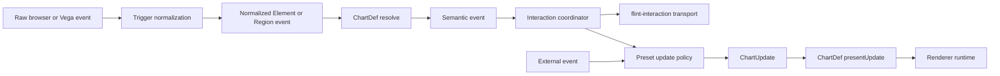
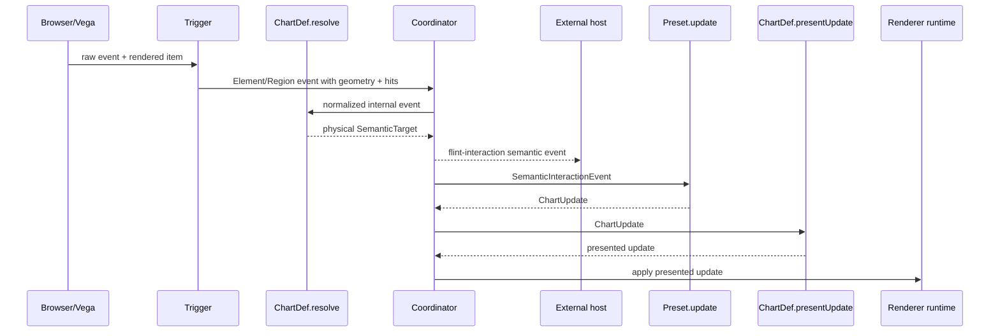
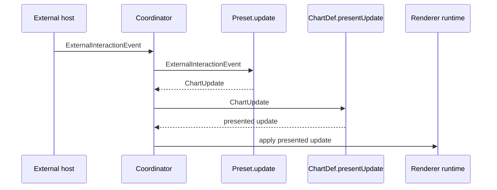

# Interaction Event Architecture

## Status

Implemented by the interactive surface, trigger modules, ChartDef semantics, presets, and Vega runtime.

## Goal

Separate interaction input, semantic resolution, policy, chart updates, and renderer presentation so that:

- canvas gestures and external application events can drive the same update language;
- chart resolution reports only the physical semantic unit that produced an internal event;
- interaction policy decides what semantic cohort to act on, including chart-specific behavior;
- chart definitions decide how semantic updates should be presented;
- runtimes apply presented updates mechanically;
- resolved semantic events can be emitted to the host application with stable chart identity.

## Pipeline



The normative ownership boundary is:

| Stage | Owner | Input | Output | Must not own |
| --- | --- | --- | --- | --- |
| 1. Normalize input | Trigger | Raw browser or renderer event | `ElementInteractionEvent` or `RegionInteractionEvent` | Semantic meaning or chart updates |
| 2. Resolve semantics | ChartDef resolver | Normalized geometry and `RenderHit[]` | Physical `SemanticTarget` | Interaction policy or cohort expansion |
| 3. Coordinate | Interaction coordinator | Resolved semantic event | Outbound event and policy invocation | Chart-specific semantic meaning |
| 4. Decide update | Preset policy | Semantic or External event | `ChartUpdate` | Renderer-specific presentation |
| 5. Present update | ChartDef `presentUpdate` | `ChartUpdate` | Chart-specific presented update | Renderer mutation |
| 6. Apply update | Renderer runtime | Presented update | Renderer state | Semantic inference or policy |

ChartDef resolves and presents chart semantics. It does **not** own DOM transport. The coordinator emits resolved semantic events externally because transport identity (`chartId`, `interactionId`, and transaction metadata) is surface-level state, not chart semantics.

An internal event follows this call sequence:



An external event bypasses trigger geometry and semantic resolution:



External events bypass chart resolution because their payload already uses the vocabulary agreed between the source and interaction definition.

## Normalized Events

```ts
type InteractionPhase = 'start' | 'preview' | 'commit' | 'cancel';

type NormalizedInteractionEvent<TExternal = unknown> =
    | ElementInteractionEvent
    | RegionInteractionEvent
    | ExternalInteractionEvent<TExternal>;

interface ElementInteractionEvent {
    type: 'element';
    phase: 'preview' | 'commit' | 'cancel';
    hits: readonly RenderHit[];
    point?: PlotPoint;
    modifiers?: InteractionModifiers;
}

interface RegionInteractionEvent {
    type: 'region';
    phase: InteractionPhase;
    region: PlotRect | PlotPolygon;
    hits: readonly RenderHit[];
    match: 'intersect' | 'contain';
    modifiers?: InteractionModifiers;
}

interface ExternalInteractionEvent<TPayload = unknown> {
    type: 'external';
    source: string;
    phase: InteractionPhase;
    payload: TPayload;
}
```

`Element` and `Region` describe physical chart input at the geometry level. They may contain coordinates, region geometry, rendered mark metadata, and data records in `RenderHit[]`, but they do not claim semantic meaning. `External` is deliberately generic and typed by the interaction that consumes it.

## Semantic Resolution

Only internal Element and Region events are resolved. The owning ChartDef resolver is observational and data-driven. It answers what physical visual/data unit produced the event, not what should happen because of it.

```ts
interface SemanticInteractionEvent {
    type: 'semantic';
    source: 'element' | 'region';
    phase: InteractionPhase;
    target: SemanticTarget | null;
    point?: PlotPoint;
    region?: PlotRect | PlotPolygon;
    modifiers?: InteractionModifiers;
}
```

For a dumbbell endpoint, resolution returns a single unit such as `point[Country=US, Sex=Male]`. It does not add the female endpoint or connector.

After resolution, the coordinator constructs the semantic event, emits it through `flint-interaction`, and passes it to the matching preset. External emission is therefore downstream of ChartDef resolution but is not performed by ChartDef.

## Interaction Policy

An interaction consumes either a resolved semantic event or an external event and returns a chart update.

```ts
type InteractionInput<TExternal = unknown> =
    | SemanticInteractionEvent
    | ExternalInteractionEvent<TExternal>;

interface InteractionDef<TExternal = unknown> {
    readonly id: string;
    readonly eventSource: InteractionEventSource;
    update(
        event: InteractionInput<TExternal>,
        context: InteractionContext,
    ): ChartUpdate | null;
}
```

Chart-specific action policy belongs here. For example, element highlighting for `Ranged Dot Plot` expands the resolved endpoint to both endpoints and the connector before producing an `emphasize` update.

Presets are compositions of predefined triggers from `interactive/triggers/` and policies. They refer to reusable descriptors such as `clickTrigger` and `rectangleTrigger()` rather than defining event acquisition inline. They are convenience APIs, not architectural primitives.

## Triggers

`interactive/triggers/` owns the event-source contracts, built-in trigger definitions, the shared interaction-event vocabulary, and renderer-specific user-event normalization. Interaction policy types only refer to those contracts; they do not define event acquisition.

Type colocation does not change production ownership: triggers produce only Element, Region, and External normalized events. The coordinator produces `SemanticInteractionEvent` only after ChartDef resolution. Its type lives in `events.ts` so the full event vocabulary has one definition site.

Flint provides common triggers for element activation, hover preview, rectangle drag, and external dispatch:

```ts
clickTrigger
hoverTrigger
rectangleTrigger('intersect' | 'contain')
externalTrigger(source?)
```

The folder is organized as:

- `index.ts`: event-source contracts and built-in trigger definitions.
- `events.ts`: shared geometry, phases, normalized input event types, and the post-resolution semantic event type.
- `vega.ts`: Vega coordinates, scenegraph hits, legend targets, and region geometry normalization.

The public triggers are exported from `flint-chart/interactive`. The source contract remains open so applications can define custom sources.

A source may register listeners, track gesture state, compute renderer geometry, inspect rendered marks, and emit normalized events. It must not resolve semantic targets, contain chart-type policy, mutate renderer state, or construct chart updates.

## Update Language

`ChartUpdate` is the only interaction-to-chart command language. Updates have a phase and renderer-neutral operations such as emphasize, annotate, and reset.

```ts
interface ChartUpdate {
    phase?: InteractionPhase;
    ops: readonly UpdateOp[];
}
```

`preview` is transient, `commit` changes persistent state, and `cancel` restores the last committed state. Chart definitions lower semantic operations through `presentUpdate`; runtimes apply the lowered result mechanically.

## External Dispatch

An interactive surface exposes a chart-scoped dispatch API:

```ts
surface.dispatch({
    type: 'external',
    source: 'story-scroll',
    phase: 'preview',
    payload: { countries: ['Japan'] },
});
```

The event is offered to matching interaction definitions without semantic resolution.

## Outbound Events

Resolved internal events are emitted as a bubbling, composed DOM event named `flint-interaction`.

```ts
interface FlintInteractionEventDetail {
    chartId: string;
    interactionId: string;
    timestamp: number;
    transactionId?: string;
    event: SemanticInteractionEvent;
}
```

`chartId` identifies the source chart and remains stable for the surface lifetime. It is available on `surface.chartId` and as `data-flint-chart-id` on the surface element. `interactionId` identifies the policy receiving the event.

The interaction coordinator, not ChartDef, owns this emission. Outbound emission does not depend on whether the preset returns a canvas update. External applications may coordinate text, tables, or other charts from semantic events while leaving the source chart unchanged.

## Identity

Callers should provide `chartId` when coordinating charts. Flint generates an ID when omitted. Re-rendering, viewport changes, and data updates do not change the resolved ID.

Chart identity belongs to the transport envelope, not `SemanticTarget`: semantic targets describe visual/data identity, while `chartId` describes event origin or dispatch destination.

## Compatibility

Existing helpers remain presets:

- `clickHighlight()`
- `clickGroupHighlight()`
- `clickAnnotate()`
- `select()`

They are implemented on the normalized event pipeline. Existing chart resolution and `presentUpdate` hooks remain valid; chart-specific action expansion moves into interaction policy.
