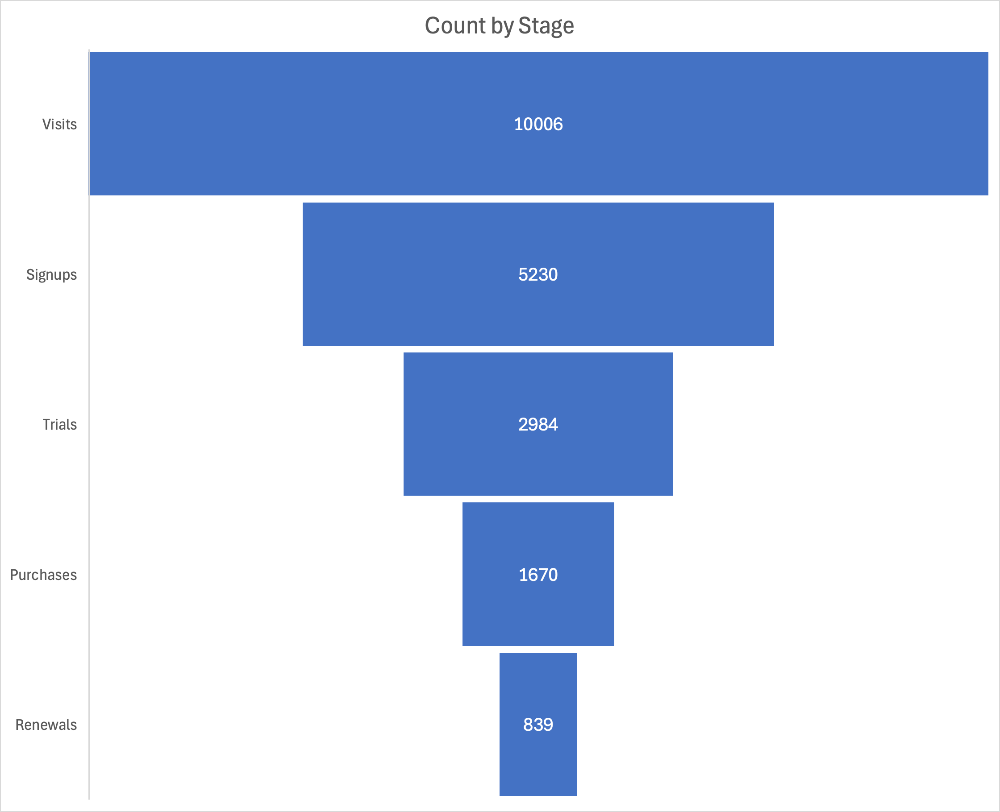
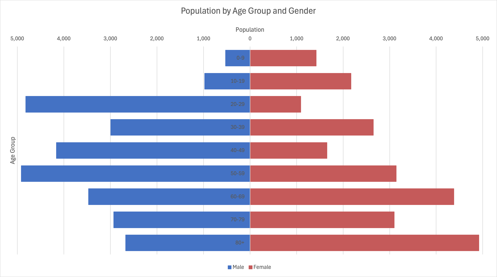
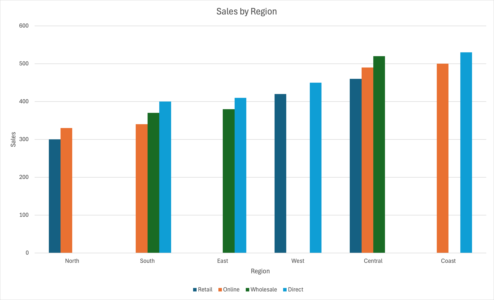
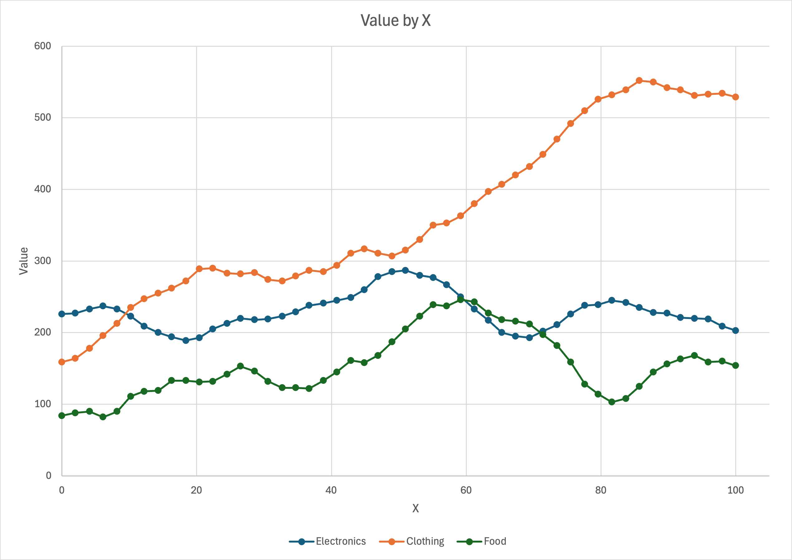
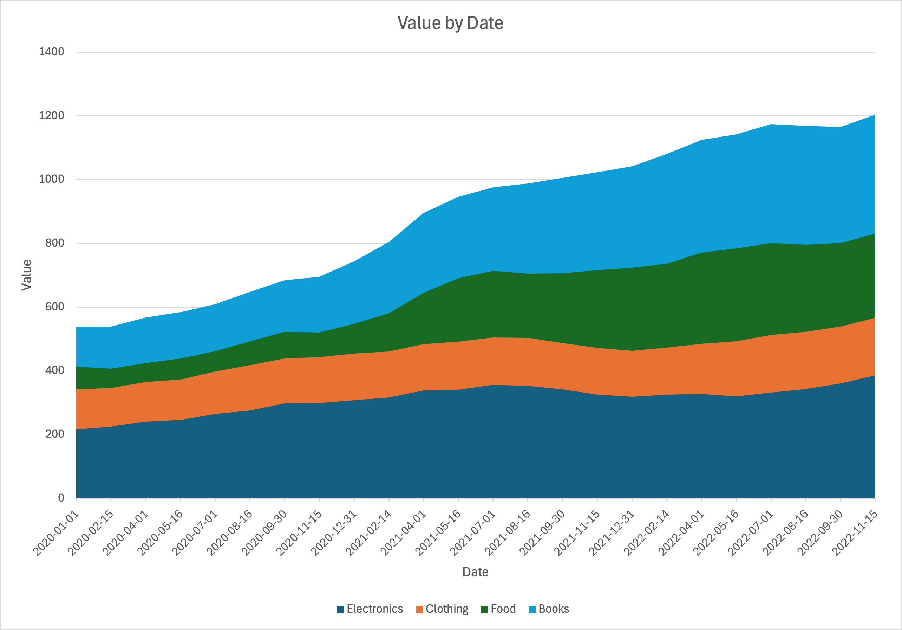
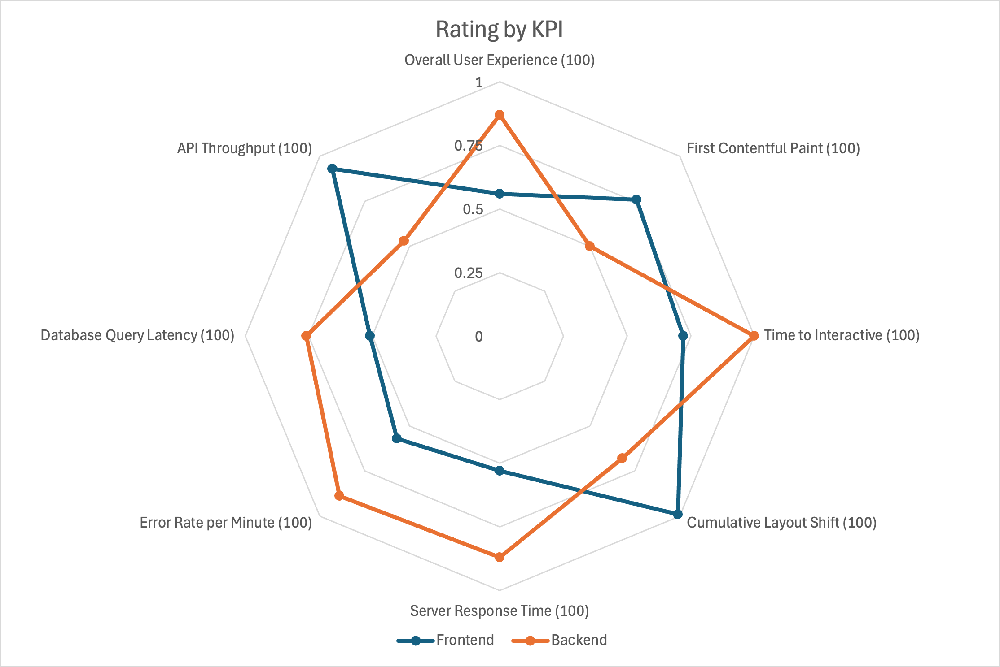
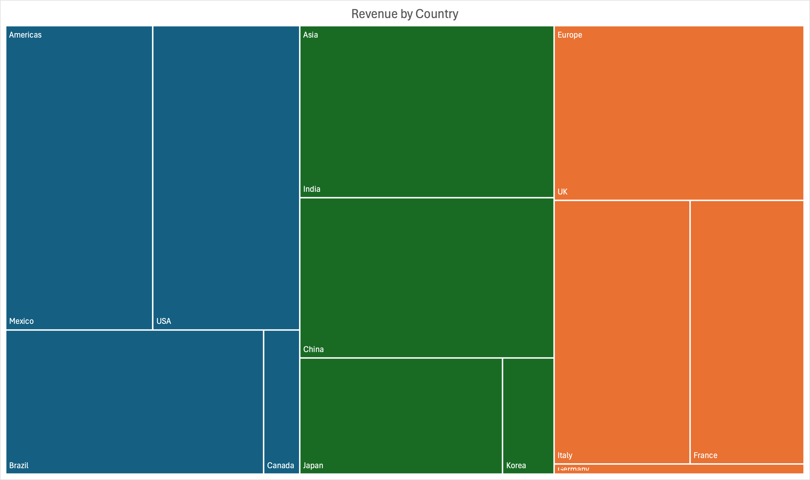
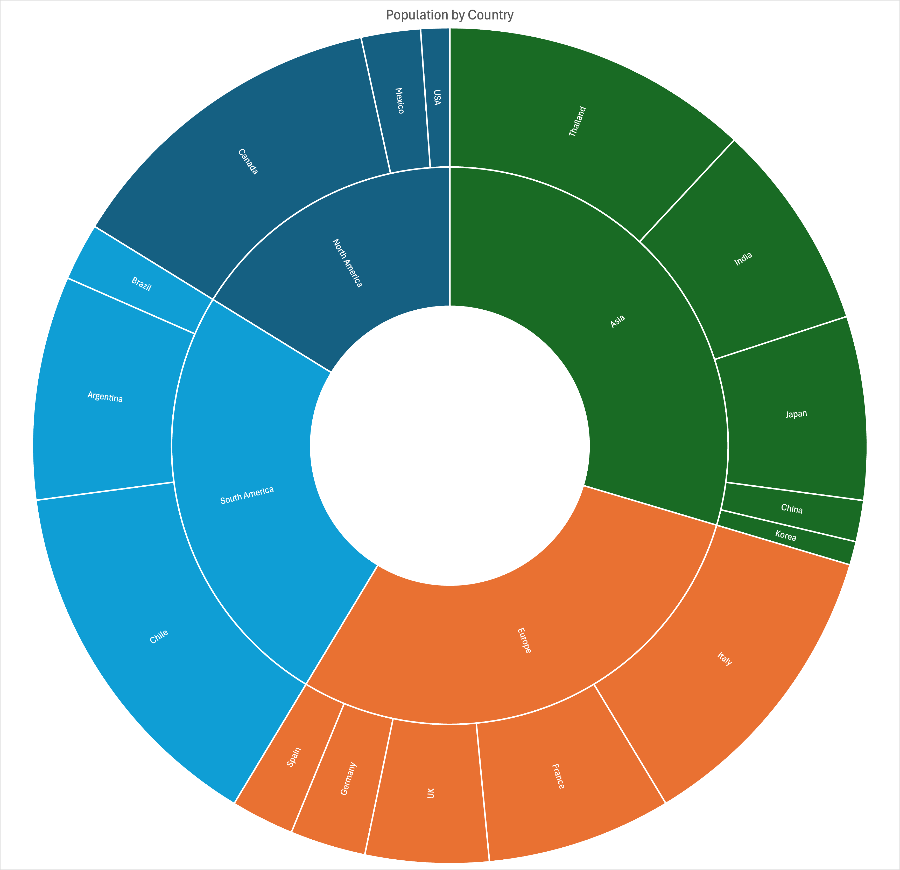
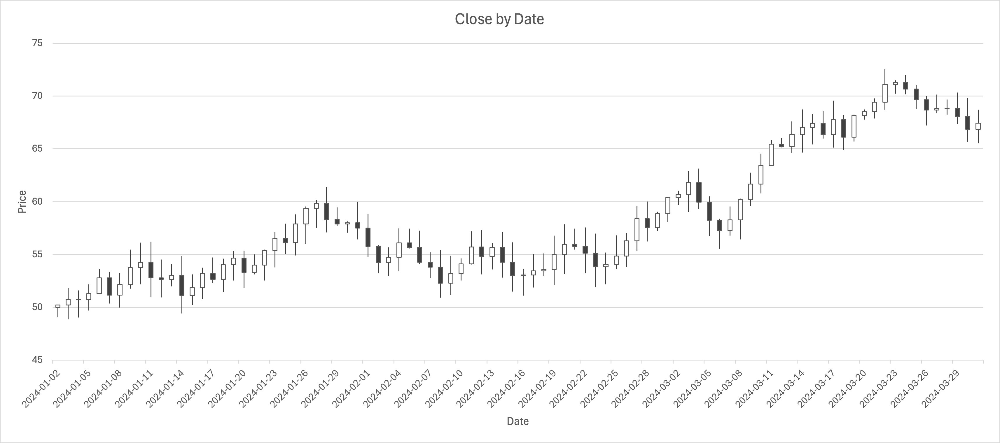

# Native Excel chart examples

These are committed snapshots from the real Excel for Mac Office.js worker. Every image is a native Excel chart captured with `Chart.getImage()` from a versioned `flint.excel.chart/v1` artifact. The bulk evaluation output remains ignored under `evaluations/out/`.

<table>
<tr>
<td width="50%"><strong>Funnel</strong><br><code>Excel.ChartType.funnel</code> · <a href="../inputs/funnel-chart/00-card5.flint.json">semantic input</a><br></td>
<td width="50%"><strong>Population pyramid</strong><br><code>Excel.ChartType.barStacked</code> · <a href="../inputs/pyramid-chart/00-card18.flint.json">semantic input</a><br></td>
</tr>
<tr>
<td width="50%"><strong>Grouped bar</strong><br><code>Excel.ChartType.columnClustered</code> · <a href="../inputs/grouped-bar-chart/14-card6.flint.json">semantic input</a><br></td>
<td width="50%"><strong>Multi-series line</strong><br><code>Excel.ChartType.xYScatterLines</code> · <a href="../inputs/line-chart/14-card50.flint.json">semantic input</a><br></td>
</tr>
<tr>
<td width="50%"><strong>Stacked area</strong><br><code>Excel.ChartType.areaStacked</code> · <a href="../inputs/area-chart/01-card24.flint.json">semantic input</a><br></td>
<td width="50%"><strong>Radar</strong><br><code>Excel.ChartType.radarMarkers</code> · <a href="../inputs/radar-chart/05-card8.flint.json">semantic input</a><br></td>
</tr>
<tr>
<td width="50%"><strong>Treemap</strong><br><code>Excel.ChartType.treemap</code> · <a href="../inputs/treemap/01-card0.flint.json">semantic input</a><br></td>
<td width="50%"><strong>Sunburst</strong><br><code>Excel.ChartType.sunburst</code> · <a href="../inputs/sunburst-chart/02-card0.flint.json">semantic input</a><br></td>
</tr>
<tr>
<td width="50%"><strong>Candlestick</strong><br><code>Excel.ChartType.stockOHLC</code> · <a href="../inputs/candlestick-chart/01-card90.flint.json">semantic input</a><br></td>
<td width="50%"></td>
</tr>
</table>

## Refresh snapshots

With the Office runner and Excel task pane open, regenerate the selected cases and then copy the verified outputs into this tracked directory:

```bash
npm run evaluate:gallery -- funnel-chart 1
npm run evaluate:gallery -- pyramid-chart 1
npm run evaluate:gallery -- grouped-bar-chart 15
npm run evaluate:gallery -- line-chart 15
npm run evaluate:gallery -- area-chart 2
npm run evaluate:gallery -- radar-chart 6
npm run evaluate:gallery -- treemap 2
npm run evaluate:gallery -- sunburst-chart 3
npm run evaluate:candlestick
npm run evaluate:examples
```

Review the images before committing refreshed snapshots. Native Excel rendering can vary slightly across Excel versions and platforms.
