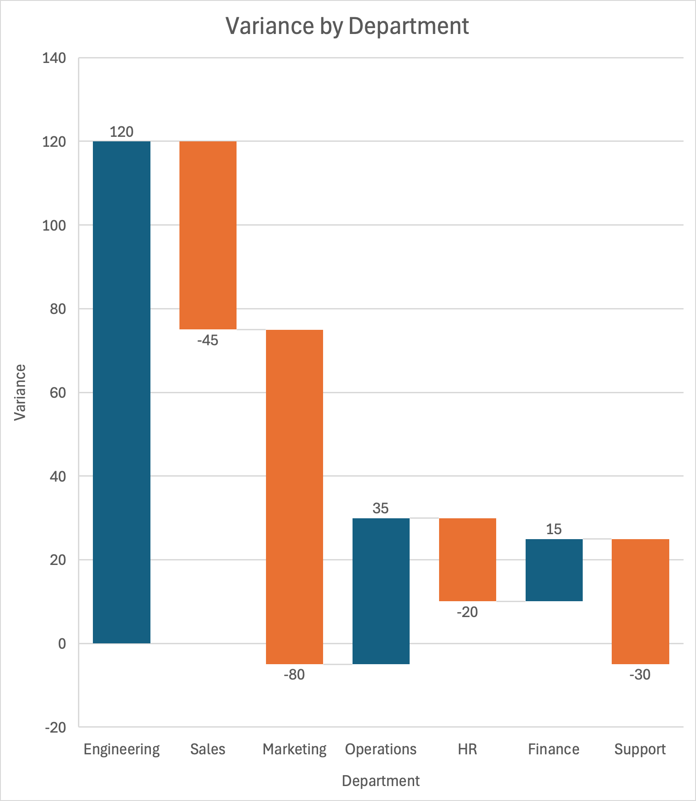

# Native Excel chart examples

Flint generates native Excel charts from semantic chart specs. These examples were rendered in Excel for Mac through Office.js and remain editable in Excel.

<table>
<tr>
<td width="33%" align="center"><strong>Grouped bar</strong><br><br></td>
<td width="33%" align="center"><strong>Multi-series line</strong><br><br></td>
<td width="33%" align="center"><strong>Stacked area</strong><br><br></td>
</tr>
<tr>
<td width="33%" align="center"><strong>Treemap</strong><br><br></td>
<td width="33%" align="center"><strong>Sunburst</strong><br><br></td>
<td width="33%" align="center"><strong>Waterfall</strong><br><br></td>
</tr>
<tr>
<td width="33%" align="center"><strong>Population pyramid</strong><br><br></td>
<td width="33%" align="center"><strong>Radar</strong><br><br></td>
<td width="33%" align="center"><strong>Candlestick</strong><br><br></td>
</tr>
</table>

## About these charts

- Each chart is a native Excel chart object, not a canvas overlay or pasted image.
- Data, formatting, titles, axes, and series can be edited in Excel.
- Flint compiles each semantic input into a versioned artifact for Office.js rendering or code generation.

<details>
<summary><strong>How these examples were produced</strong></summary>

These images are unedited captures from the real Excel for Mac Office.js worker using `Chart.getImage()`. Each chart was assembled from a Flint semantic input into a versioned `flint.excel.chart/v1` artifact, then rendered as a native Excel chart.

| Example | Native Excel chart | Flint input |
| --- | --- | --- |
| Stacked area | `AreaStacked` | [View input](../inputs/area-chart/01-card24.flint.json) |
| Grouped bar | `ColumnClustered` | [View input](../inputs/grouped-bar-chart/00-card4.flint.json) |
| Multi-series line | `XYScatterLines` | [View input](../inputs/line-chart/14-card50.flint.json) |
| Treemap | `Treemap` | [View input](../inputs/treemap/01-card0.flint.json) |
| Sunburst | `Sunburst` | [View input](../inputs/sunburst-chart/02-card0.flint.json) |
| Waterfall | `Waterfall` | [View input](../inputs/waterfall-chart/02-card7.flint.json) |
| Population pyramid | `BarStacked` | [View input](../inputs/pyramid-chart/00-card18.flint.json) |
| Radar | `RadarMarkers` | [View input](../inputs/radar-chart/05-card8.flint.json) |
| Candlestick | `StockOHLC` | [View input](../inputs/candlestick-chart/01-card90.flint.json) |

</details>

<details>
<summary><strong>Refresh the snapshots</strong></summary>

With the Office runner and Excel task pane open, regenerate the selected cases:

```bash
npm run evaluate:gallery -- waterfall-chart 3
npm run evaluate:gallery -- pyramid-chart 1
npm run evaluate:gallery -- grouped-bar-chart 1
npm run evaluate:gallery -- line-chart 15
npm run evaluate:gallery -- area-chart 2
npm run evaluate:gallery -- radar-chart 6
npm run evaluate:gallery -- treemap 2
npm run evaluate:gallery -- sunburst-chart 3
npm run evaluate:candlestick
npm run evaluate:examples
```

Review the images before committing refreshed snapshots. Native Excel rendering can vary slightly across Excel versions and platforms.

</details>
